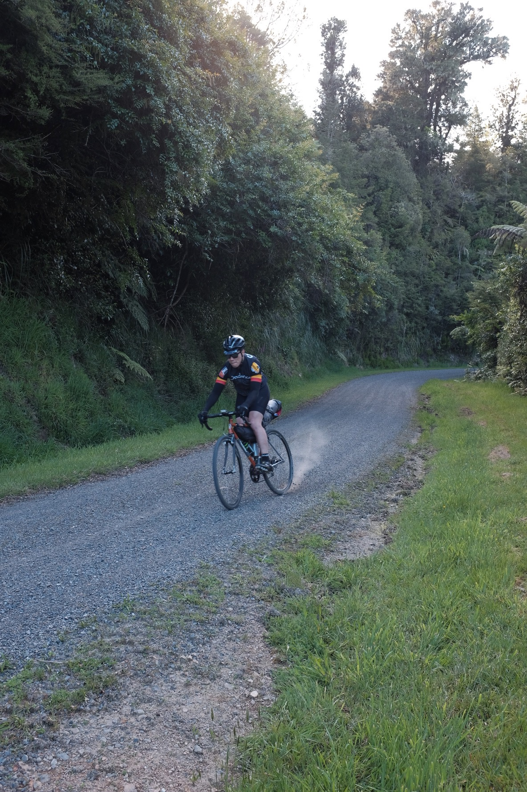

"I yearn for adventure!" – was what Sam and I shouted at each other through WhatsApp one evening after watching the first [Outskirts: Route 66](https://www.youtube.com/watch?v=Dh25fH5diwQ). There's nothing quite like the feeling of exploring on two wheels. The joy of discovering new grounds at your own pace always brings a smile to our faces. Some say it's an addiction, I don't disagree.

It didn't take long until I purchased a second hand [Surly Straggler Disc](https://surlybikes.com/bikes/straggler), and began planning a bike packing trip. Since this is the first time for both Sam and I, we didn't dare go far. We picked somewhere relatively close to home: Hunua. We met up on Friday around noon at Sam's work, inhaled some burgers, then took the train to Papakura.

From Papakura we steadily made our way to the camp site at <marker-link lat="-36.972674" lng="175.253317" zoom="15">Tapapakanga Regional Park </marker-link>, roughly 70km away. First 20km was nice and flat, filled with plenty of banter between Sam and I. We even made a coffee stop at <marker-link lat="-37.082379" lng="175.072498" zoom="15">Ranges Bar & Cafe</marker-link> before realising we're on a tight schedule to make it to the campsite before sunset.

As we turned left onto Moumoukai Rd, we turned a bit nervous. We knew we had gravel roads coming up. The gravel section along Moumoukai Rd & A R A Dr wasn't new to us, as we had already done a recon ride a few weeks prior. However we weren't carrying any extra gears like this trip. To make things even harder, I had forgotten the fact that I recently swapped out my front crankset from compact (39/34) to traditional (53/39). We didn't know what to expect, other than to keep pedaling.

# Momoukai Rd Climb
As we hit the climb on Moumoukai, I could immediately feel the extra weight dragging me. It wasn't too bad though, in the back of my mind I know this isn't the steepest bit yet, so I just white knuckled the whole way up. Then came the descent into A R A Dr, where I am glad I have some decent [Vittoria Cross XG Pro 34](https://www.bikeradar.com/road/gear/category/components/tyres/road/product/review-vittoria-cross-xg-pro-tyre-12-46757/) tyres to avoid slipping through the gravel and eat shit.

# A R A Dr Climb
Going up this climb on A R A Dr was hell. It was only 2km but with an average gradient of 13%. It was hard enough the first time without any extra gears. This time it was utterly unenjoyable, and I was forced to come to a complete stop half way up. You know you're going slow when your [ELEMNT](https://au.wahoofitness.com/devices/bike-computers/gps-bike-computer-elemnt) computer auto-pauses on ya.

We were making progress up the hill, albeit rather slowly. Sam and I eventually made it to the top of A R A Dr, where we stopped second guessing our life choices and began looking forward to the rest of the route. At this point were were only about half way (30km) into the whole trip, but we knew the hardest climb was behind us. All that's left is a sweet descent, followed by some flat coastal roads into the camp site. 

# Mechanical breakdown
Unfortunately (but thankfully) after the descent, Sam's bike chain broke. It was very fortunate that I had packed a chain tool in my bag, otherwise we would be stranded in the middle of the ranges praying for the reception gods to call for an Uber.

Along the rest of the way to made plenty of quick stops when photo ops presents itself.

