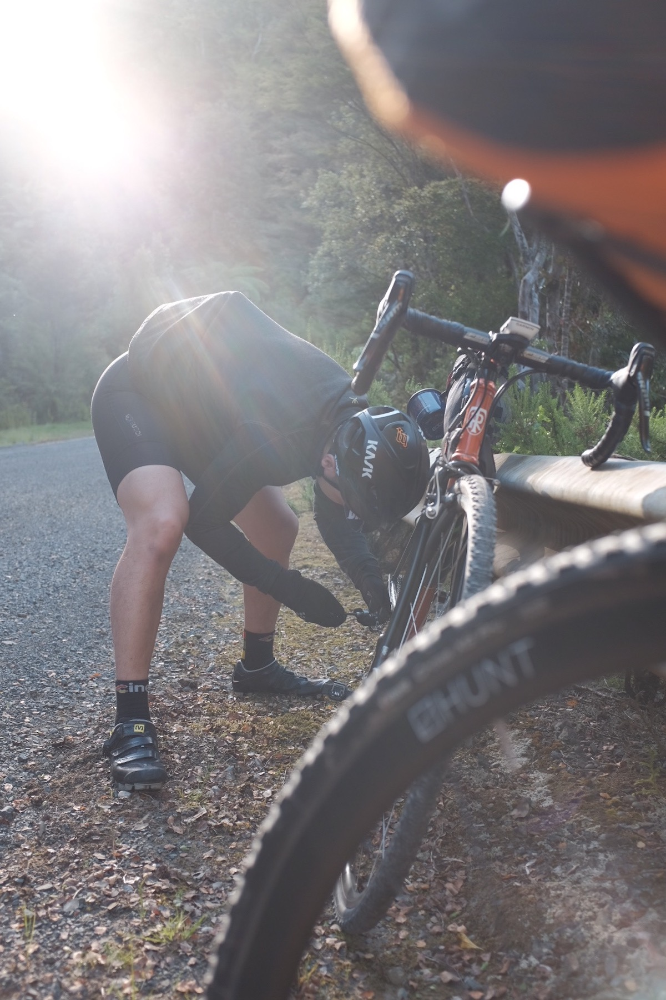

"I yearn for adventure!" – was what Sam and I shouted at each other through WhatsApp one evening after watching the first [Outskirts: Route 66](https://www.youtube.com/watch?v=Dh25fH5diwQ). There's nothing quite like the feeling of exploring on two wheels. The joy of discovering new grounds at your own pace always brings a smile to our faces. Some say it's an addiction, I don't disagree.

It didn't take long until I purchased a second hand [Surly Straggler Disc](https://surlybikes.com/bikes/straggler), and began planning a bike packing trip. Since this was the first time for both Sam and I, we didn't dare go far. We picked somewhere relatively close to home: Hunua. We met up on Friday around noon at Sam's work, inhaled some burgers, then took the <marker-link label="A" lat="-37.064982" lng="174.945096" zoom="15">train to Papakura </marker-link>.

From there we steadily made our way to the camp site at <marker-link label="B" lat="-36.972674" lng="175.253317" zoom="15">Tapapakanga Regional Park </marker-link>, roughly 70km away. The first 20km was nice and flat, filled with plenty of banter. We even made a coffee stop at <marker-link lat="-37.082379" lng="175.072498" zoom="15" label="C">Ranges Bar & Cafe</marker-link> before realising we were pressed with time if we want to arrive at campsite before dark.

As we turned left onto Moumoukai Rd, we became a bit nervous because we knew gravel roads were coming up. The gravel section along Moumoukai Rd & A R A Dr wasn't new to us, as we had already done a recon ride a few weeks prior. However we weren't carrying any extra gears like this trip. To make things even harder, I had forgotten the fact that I recently swapped out my front crankset from compact (39/34) to traditional (53/39). We didn't know what to expect, other than to keep pedaling.

# Momoukai Rd Climb

As we hit the climb on Moumoukai, I could immediately feel the extra weight dragging me. It wasn't too bad though, in the back of my mind I know this isn't the steepest bit yet, so I just white knuckled the whole way up. Then came the descent into A R A Dr, where I was glad I had some decent [Vittoria Cross XG Pro 34](https://www.bikeradar.com/road/gear/category/components/tyres/road/product/review-vittoria-cross-xg-pro-tyre-12-46757/) tyres to avoid slipping through the gravel and eat shit.

# A R A Dr Climb

Going up this climb on A R A Dr was hell. It was only 2km but with an average gradient of 13%. It was hard enough the first time without any extra gears. This time it was utterly unenjoyable. I was forced to come to a complete stop half way up. You know you're going slow when your [ELEMNT](https://au.wahoofitness.com/devices/bike-computers/gps-bike-computer-elemnt) computer auto-pauses on ya.

We were making progress up the hill, albeit rather slowly. We eventually made it to the top of A R A Dr, where we stopped second guessing our life choices and began looking forward to the rest of the route. At this point we were only half way (30km) into the whole trip, but we knew the hardest climb was behind us. All that's left is a sweet descent, followed by some flat coastal roads into the camp site.

# Mechanical breakdown

Unfortunately after the descent, Sam's bike chain broke. Luckily I packed a chain tool in my bag, otherwise we would be stranded in the middle of the ranges praying for the reception gods to call for an Uber.

Along the rest of the way we made plenty of quick stops when photo ops presents itself.

# Campsite Arrival

We blitzed through the flat East Coast Rd and made a <marker-link lat="-36.983723" lng="175.248806" label="D" zoom="15">right turn into Tapapakanga Regional Park </marker-link>. Immediately passing through the gates we were greeted by a flock of sheep.

Upon arrival, we had about 30 minutes to spare before dark. We quickly set up the tent and prepared dinner – [Back Country Cuisine: Free Dried food](https://backcountrycuisine.co.nz/). Sam and I both were pleasantly surprised by how delicious it was. It's not the most economical way of camping, but the weight savings compared to carrying fresh ingredients were largely beneficial for an overnight trip like this.

By the time we finished dinner it was about 10pm. We were both knackered and ready for bed. The sleep turned out to be a bit of a nightmare.

Firstly, Sam, the brave, did not bring a sleeping bag and thought his down jacket will suffice the drop in temperature overnight. He was wrong.

Secondly, we made the mistake of setting up the tent on a slope, and both found ourselves toss & turning in the middle of the night waking up at a corner of the tent. It was like sleeping on a slide, but not the fun kind.

Overall I managed to get a good 7 hours of light sleep, Sam only had a couple. Oops. Lesson learned.

We woke up at 6am to cook breakfast (Backcountry Cuisine). Both of us needed to be home before noon so we packed up and left the camp ground by 8am.

This overnight bike packing trip has been a learning curve for both of us. We both knew this was the first of many trips to come, because there are still so many spots in our backyard that are better discovered on two wheels.

If you enjoyed reading this ride, you can download the route file in the link below.
