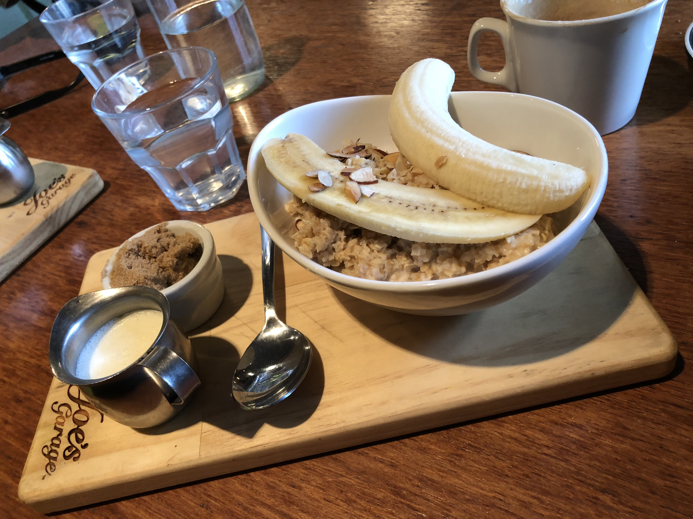

**Why catch a plane when you can ride 900k from Wellington to Auckland?** This is a story about two optimistic bike fanatics taking a punt at riding 900 km from Wellington to Auckland over 4 days.

In the beginning of 2018 I was staying in Wellington for work. Near the end, instead of flying home to Auckland, Sam and I decided it would be more epic to ride our bikes from Wellington to Auckland. We convinced ourselves that this could be one of our epic tales we share in the future. [Lots of people](https://www.dynamoevents.co.nz/event/bdo-wellington-to-auckland-cycle-challenge-2017/) have done this ride before, surely we can do it — or so we thought.

We picked a route 900 km in total, and set out to complete it over 4 days.

- [Day 1: Wellington to Whanganui (200 km / 1200 m elevation)](https://www.google.co.nz/maps/dir/Wellington/Whanganui/@-40.605871,174.5307259,9z/data=!3m1!4b1!4m14!4m13!1m5!1m1!1s0x6d38b1fc49e974cb:0xa00ef63a213b470!2m2!1d174.776236!2d-41.2864603!1m5!1m1!1s0x6d6ab8747e76634b:0x500ef6143a39932!2m2!1d175.0478901!2d-39.9300887!3e1)
- [Day 2: Whanganui to Taupo (238 km / 2600 m elevation)](https://www.google.co.nz/maps/dir/Whanganui/Taupo/@-39.3755184,175.0061628,9z/data=!3m1!4b1!4m14!4m13!1m5!1m1!1s0x6d6ab8747e76634b:0x500ef6143a39932!2m2!1d175.0478901!2d-39.9300887!1m5!1m1!1s0x6d6bef77144b165b:0x500ef6143a309e0!2m2!1d176.0702098!2d-38.6856924!3e1)
- [Day 3: Taupo to Hamilton (158 km / 1200 m elevation)](https://www.google.co.nz/maps/dir/Taupo/Hamilton/@-38.2100756,175.3946074,10z/data=!3m1!4b1!4m14!4m13!1m5!1m1!1s0x6d6bef77144b165b:0x500ef6143a309e0!2m2!1d176.0702098!2d-38.6856924!1m5!1m1!1s0x6d6d227487a63621:0x500ef6143a29903!2m2!1d175.279253!2d-37.7870012!3e1)
- [Day 4: Hamilton to Auckland (151 km / 600 m elevation)](https://www.google.co.nz/maps/dir/Taupo/Hamilton/@-38.2100756,175.3946074,10z/data=!3m1!4b1!4m14!4m13!1m5!1m1!1s0x6d6bef77144b165b:0x500ef6143a309e0!2m2!1d176.0702098!2d-38.6856924!1m5!1m1!1s0x6d6d227487a63621:0x500ef6143a29903!2m2!1d175.279253!2d-37.7870012!3e1)

# Preperation

Sam flew into Wellington with his slick Baum green machine. He assembled the bike in 10 minutes, we left the cardboard box in the airport, and off we went to the apartment I was staying at near Mount Victoria. We spent the rest of the day chilling, enjoying a sunny cruise along Wellington waterfront. We thought the weather couldn’t have been more perfect for our multi-day bike trip the next day.

<!--
# The gears

')

|            |                         |
| :--------- | :---------------------- |
| Bike       | Ritchey Road Logic      |
| Tyre       | Panaracer GravelKing 26 |
| Saddle bag | Ortlieb                 |
| Frame bag  | Ortlieb                 |
| Saddle bag | Ortlieb                 |
| Saddle bag | Ortlieb                 |
| Saddle bag | Ortlieb                 |

 -->

# Day 1: Headwind madness

We woke up before sunrise at 6am to the sound of gusty wind hailing outside our window. Forecast told us we would be pushing through a strong 47 km/h northerly wind. That was bad news: To get to Whanganui, it’s all north, which meant we'll be served headwind for breakfast, lunch and dinner.

We headed straight to a local cafe, <marker-link lat='-41.2924544' lng='174.7816318' label='A' zoom='12' >Joe's Garage </marker-link>, and filled ourselves up with a big breakfast and caffeine.

By 8am we began our departure for Whanganui. Riding out Wellington was harder than expected. Wind was coming at us from every direction as we rode past large blocks of buildings in the city. It didn't take long before we found ourselves on the <marker-link lat='-41.242581' lng='174.812298' label='B' zoom='12'>State Highway 1</marker-link> , climbing out alongside other traffic heading north. To our surprise there were plenty of space for us on the shoulder, it wasn't as terrifying as we thought.

Along the highway there were heaps of seperate walk & cycle ways, which was always welcomed to add a bit of variety to the riding.

After the fruit stop, we hit the road again for another hour. The wind was calm, but we were 120 km into the trip and started feeling fatigue. We stopped at <marker-link lat='-40.473126' lng='175.285641' label='G' zoom='12'>Foxton</marker-link> for some snack and moral boost. We had another 100 km to go before Whanganui. We had 4 more hours of daylight and felt the need to get back on the road as soon as we could.

After Foxton we steadily made way to Bulls without much trouble. We thought we would be sweet rest of the way, but Bulls to Whanganui turned out to be the toughest section of the whole trip. Either we have physically hit a wall at the 150 km mark, or the headwind got stronger on the wide open terrain. The headwind was consistently there, working against us. We had our head down, working our legs but the fastest we could go capped at 13 km/h.

The last leg was slow and torturous, after 9.5 hours of moving time, we made it to Whanganui at 8:40pm. We rolled straight into a Noodle Canteen, had the best fried noodle of my life, then checked in at <marker-link lat='-39.926937' lng='175.046932' label='H' zoom='12'>College House Backpackers</marker-link>. Safe to say both of us were cooked after a long day, and went straight to bed.

<video src="fkyea.mp4" controls></video>

# Day 2: Mission Abort
After the first torturous day, both of us knew there was no way we would be able to finish our day 2 ride from Whanganui to Taupo – 240 km, with twice the elevation. Even worse, the forcast said it was going to rain a lot. We decided to throw in the towel and go for plan B – get hitched by a friend who were conveniently driving a bus from Wellington to Auckland on that day. We cruised 50 km back to Bulls and waited for the bus at the BP petrol station.

So there you go, this is a story about two optimistic bike fanatics taking a punt at riding 900 km from Wellington to Auckland over 4 days. We felt underprepared (physically & gear) after the first day. Knowing that was supposed to be the easiest leg, we didn't want to risk getting stranded out there with minimal summer gear. This has been a good learning experience and we're keen to do it again sometime in the future with a bigger group.