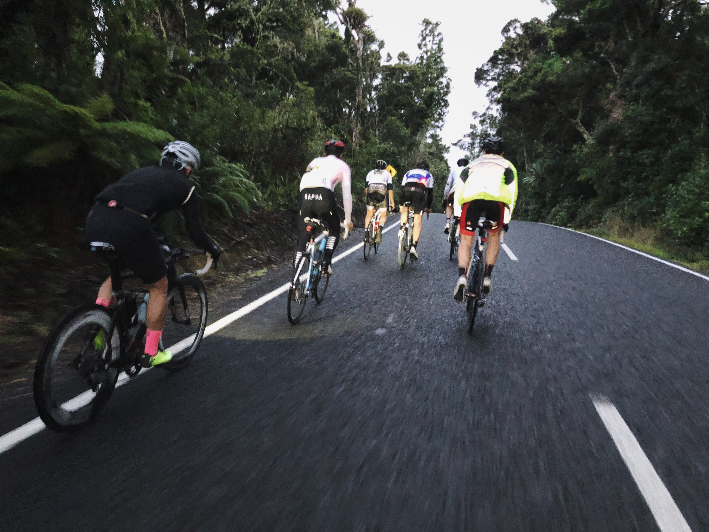
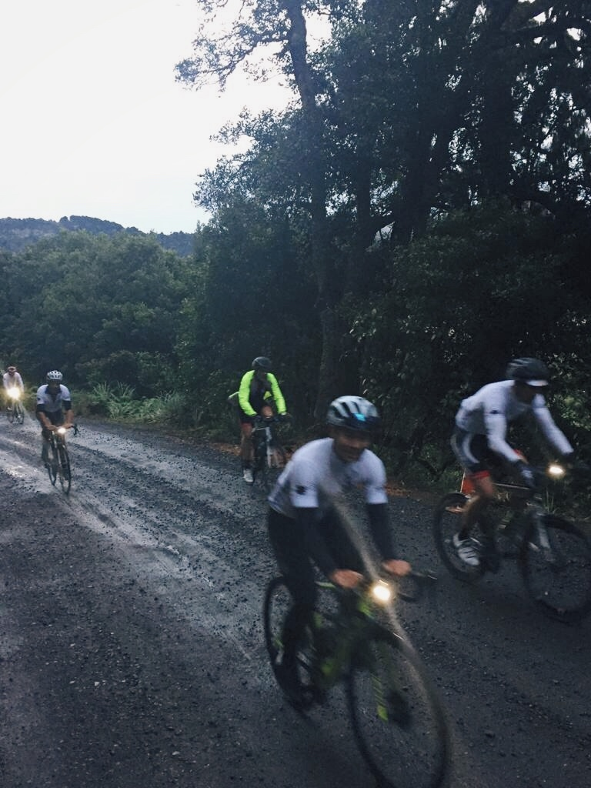
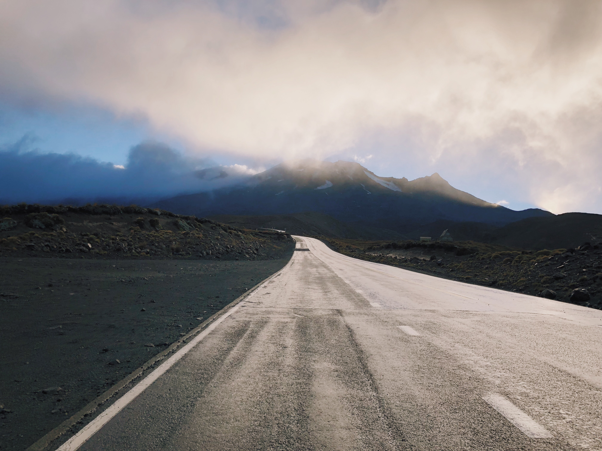
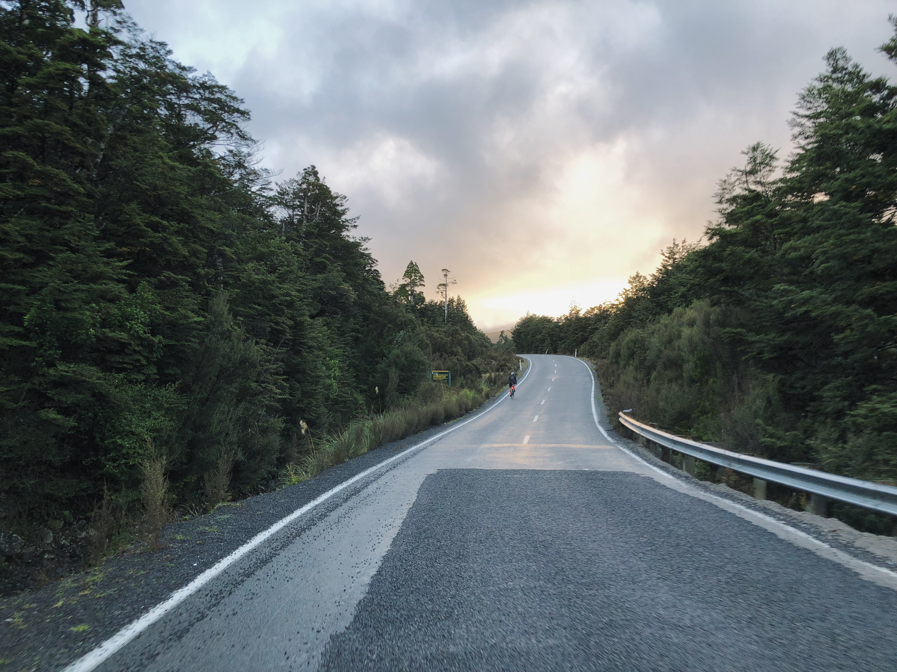
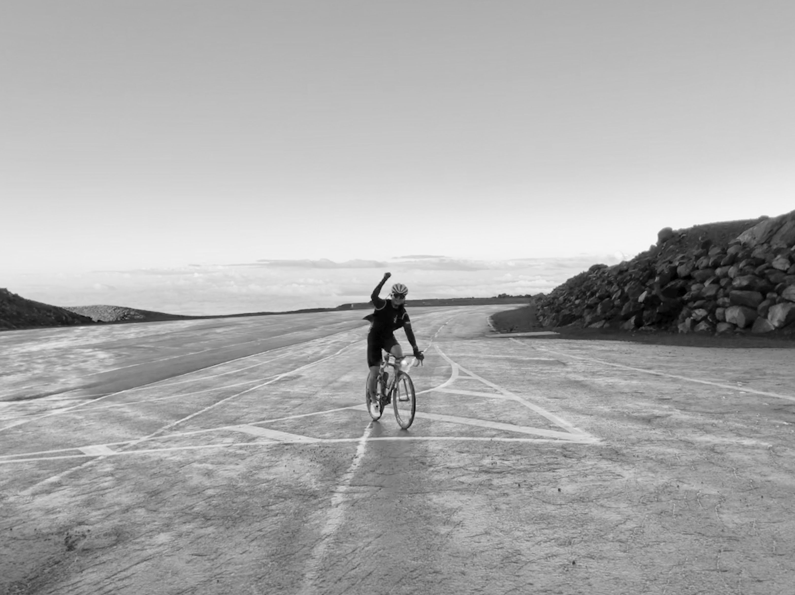

After an ultimately great 180km ride on our previous day, we’re ready to climb New Zealand's only Hors Category (HC) road. We were, and continue to be surprised that the Ohakune to Turoa climb is NZ’s only HC climb. When you think of all of the other mountain roads there are throughout NZ, it’s a little surprising. Anyway, we were heading up the hill at 7am.

<image-zoom caption="Gravel section after the base."></image-zoom>

We’d definitely not had a big night the night before. In fact, we only managed a couple of beers each. Although I am sure that had we not been riding today then it could’ve been a lot worse. We’d got all of our gear ready the night before. Most opted for just one water bottle. It’s only 17km, but would probably take us close to 90 minutes.

We set off in the rain, yet again (that was the theme for the weekend). We’d decided that we’d ride at our own pace, and if that pace included others then so be it. For the first 2 km we acclimatised and eventually took off our jackets, except Guy, he just didn’t wear one. Actually, he didn’t wear one for the whole weekend, despite the rain.

We rode together for the first 6km. That was until we reached a gravel section. Mark and I had ridden up to that point on the Friday before. We elected not to say anything, there may have been a few folk that wouldn’t ride if they knew. As soon as we hit the gravel, BOOM, Guy got a puncture. That was him out of the game. He decided rather than ruin a pair of carbon soled shoes that he’d walk down. All 6km of it. We later met him at the café.

<image-zoom caption="Gravel section after the base."></image-zoom>

The first 6km are gentle. It barely gets above 5%. The next 5km are pretty tough, with gradients barely dropping below 9%. Then there’s a rest section. It’s a false flat for a few KMs. The last 3km are just brutal. There are some pitches in the 20s, but rarely fall below 10%. It’s a tough climb. The car parks can’t come soon enough. As you make your way around the last bend it’s almost an anticlimax. One huge carpark, a few buildings, and the chairlifts.

<image-zoom caption="False flats all the way up."></image-zoom>

Kriss and Guy started hard and fast. Guy punctured, Kriss led the way. It wasn’t long before Jacky took control. With a pedal stroke so smooth, and age on his side, he soon disappeared from sight. Mark and I cycled a lot of the way together. Ian and Peter were just behind. Suddenly there was a rampaging noise behind us. Peter was on the charge. Not sure what he’d taken, but whatever it was was working well, and I wanted some.

<image-zoom caption="More false flats."></image-zoom>

Peter was a man possessed. He whizzed past me. He soon caught Mark and Kriss. And then he caught Jacky, although I wouldn’t have believed it possible. It was only when Jacky congratulated him on the KOM that I realised what had happened. For a guy who’s only been cycling 3 years, and was heavier than all of us, he managed a herculean effort.

<image-zoom caption="Kriss conquering Turoa."></image-zoom>

Jacky, followed by Mark, then myself, Kriss and Ian, all managed it, Turoa had been conquered. For most it was their first HC climb. And their first taste of what a great descent is like. It’s not often in NZ that you go downhill for 30 minutes.

We descended as quick as possible. It was freezing. We wrapped up warm, or as warm as our clothes would allow, and quickly dropped down the mountain. The only hold up was the nasty gravel section. As soon as we hit the bottom of the climb we headed straight for coffee. We all had a feeling that Guy would be there. We weren’t disappointed.

Mark went and got the car and picked up Guy and his punctured bike. We all made our way back to our lodgings. As soon as we’d finished our ablutions we were out of there, homeward bound. And if wasn’t for the traffic jams, the whole weekend would’ve been a massive success.

Thanks to everyone for making the effort.

> This entry was originally posted [here](http://greylynncycleclub.com/cycling-nzs-only-hc-climb/)
