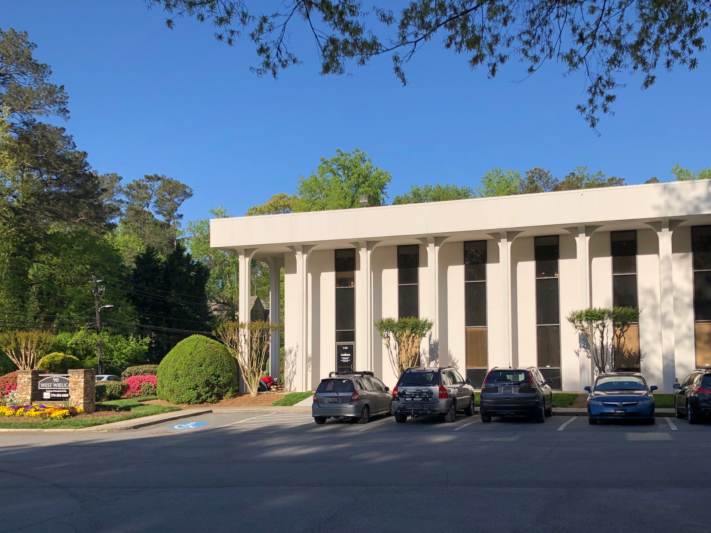
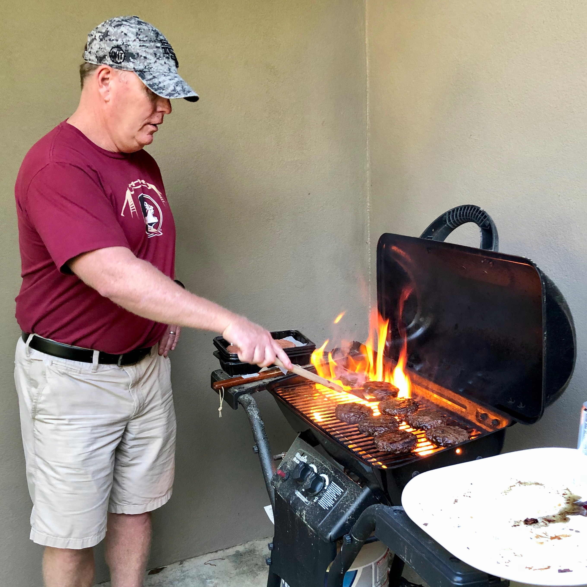
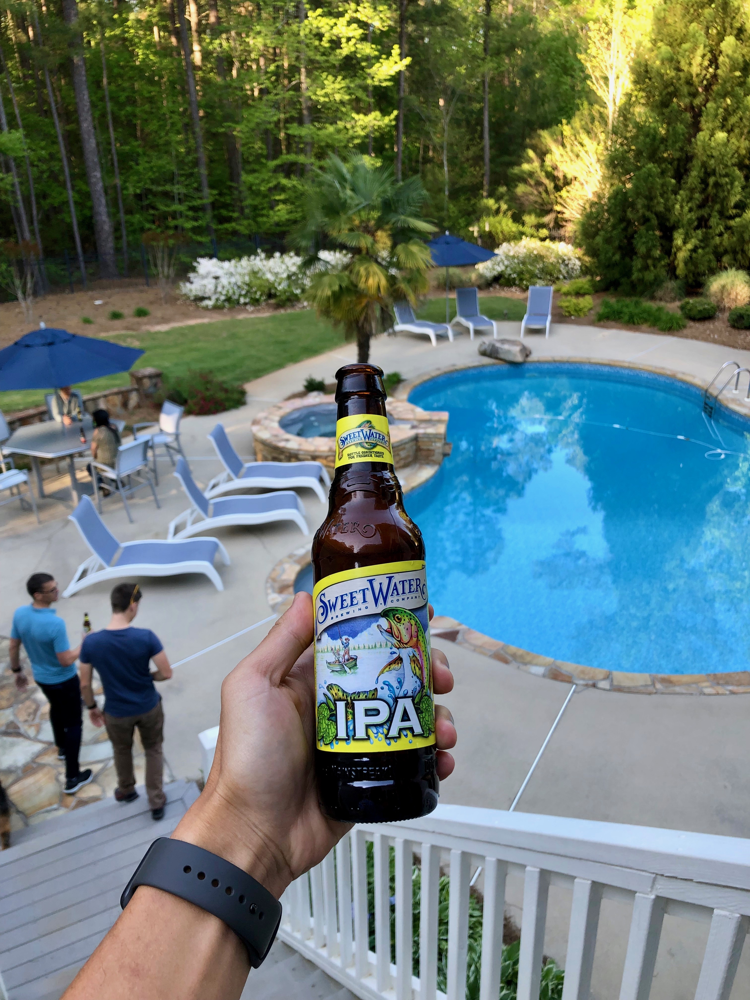
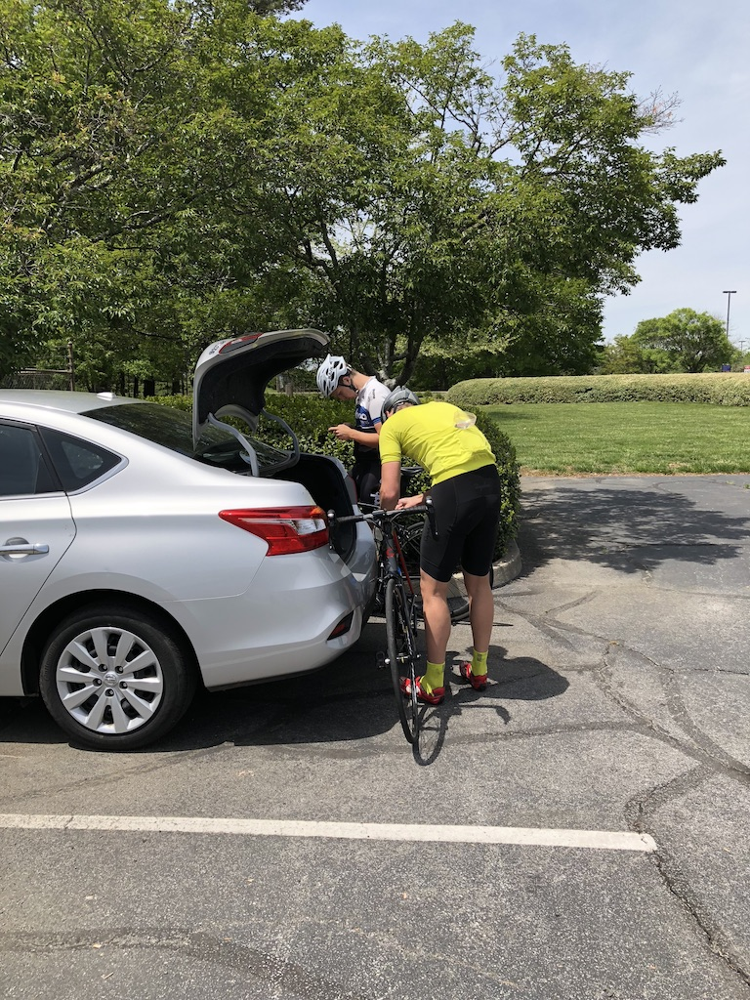
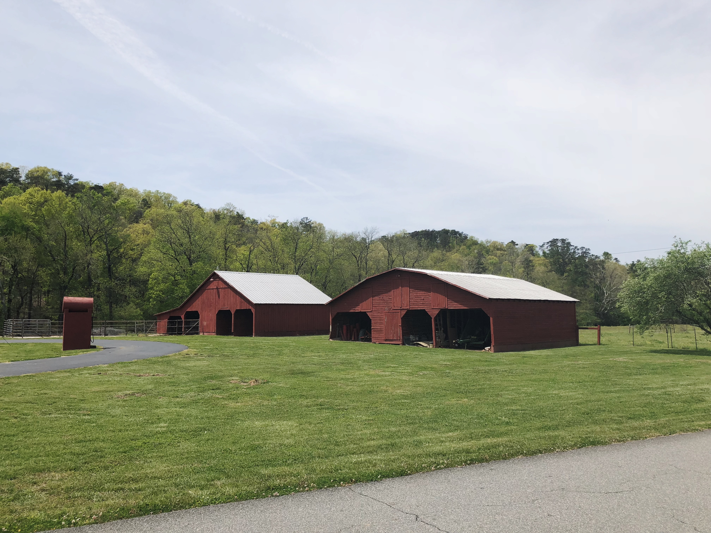
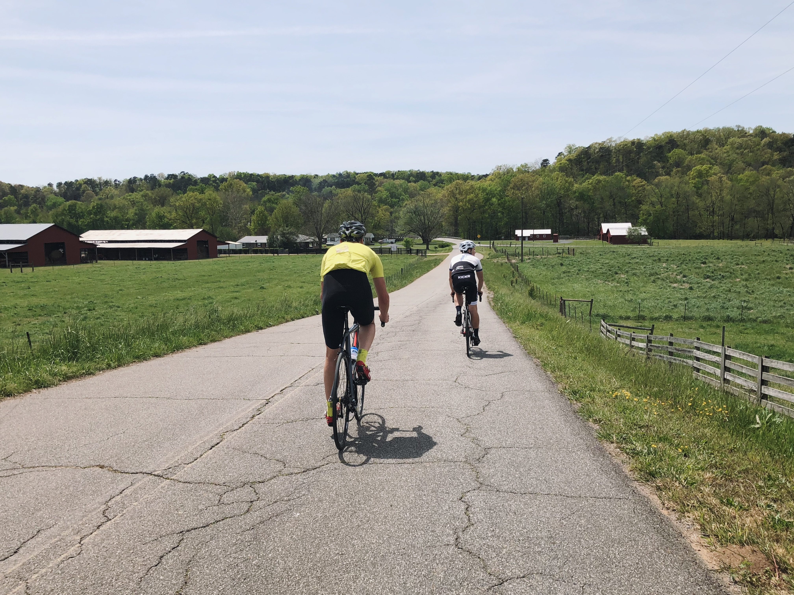
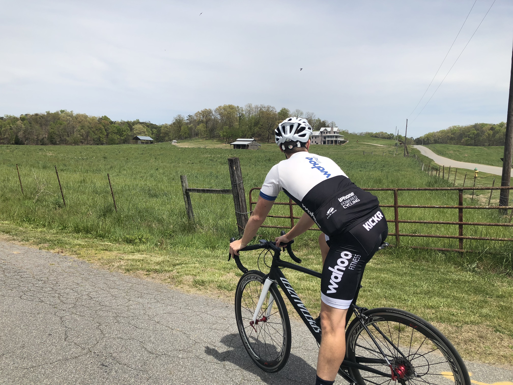
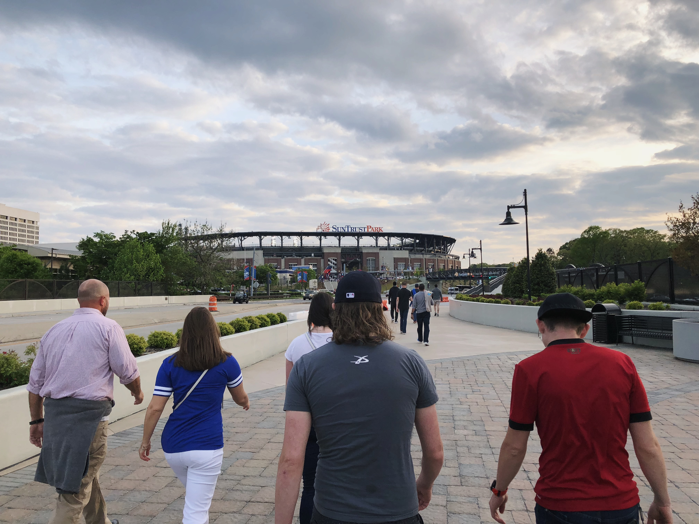
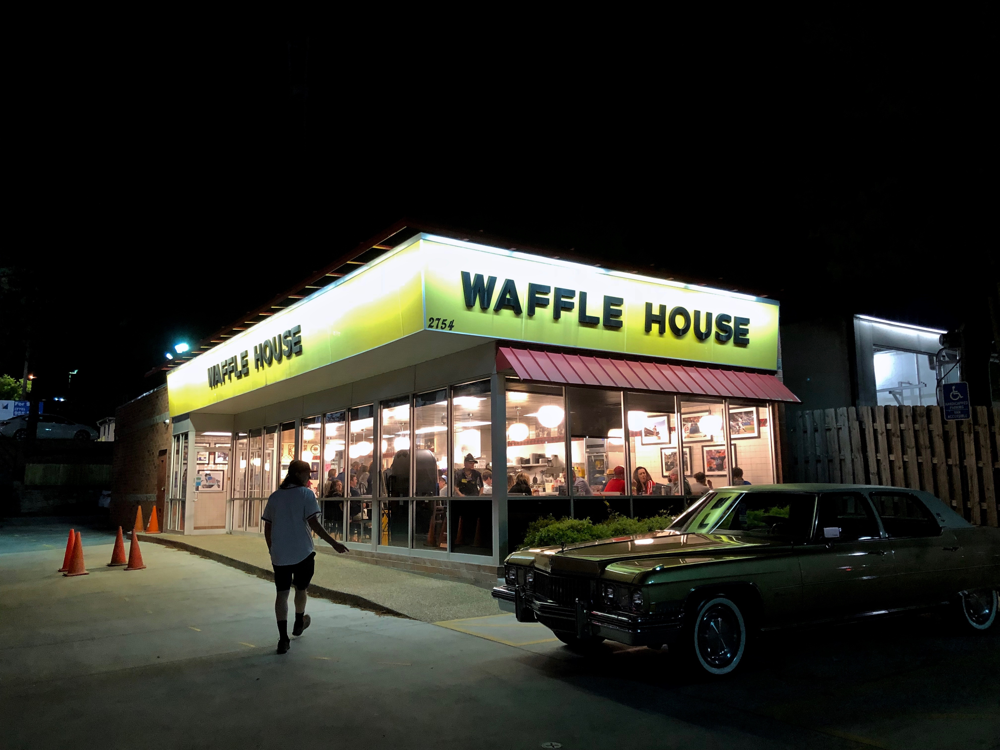

During my first week of employment at Wahoo Fitness, I went over to Atlanta, Georgia to meet everyone at <marker-link lat="33.877684" lng="-84.384866" zoom="17" label="A">Wahoo HQ</marker-link>. It was kinda cool to see the mothership in person, as I’ve only seen it previously from [DC Rainmaker](https://www.dcrainmaker.com/2014/08/behind-scenes-fitness.html).

<image-zoom caption="Wahoo Headquarters."></image-zoom>

Within the first couple of days, we were kindly hosted by David, our Head of Engineering at his mansion, to some sweet barbecue, beers & golf cart shenanigans.

<image-zoom caption="Burgers, southern style."></image-zoom>

<image-zoom caption="IPA by the pools."></image-zoom>

# Cartersville

The team organised a spare bike for me during my stay. In the weekend Ben, Michael and I headed up north to Cartersville for a nice local scenic ride. I was told we‘d be riding near some shooting locations of The Walking Dead.

We managed to fit 3 road bikes into a rental car, and drove 50 minutes to <marker-link label="B" lat="34.255914" lng="-84.783742" zoom="17">Anheuser-Busch</marker-link> car park, where we unloaded the bikes and began the ride.

<image-zoom caption="Unloading bikes from the car."></image-zoom>

<image-zoom caption="Barns."></image-zoom>

<image-zoom caption="Wahooligan butts."></image-zoom>

<image-zoom caption="More Wahooligan butts."></image-zoom>

<image-zoom caption="Ben Johnston."></image-zoom>

We rode at a nice, steady pace, taking in the surroundings around us. The weather was perfect. Occasionally I’d spot the fluttering flags of Trump and America – a patriotic sight rarely seen anywhere else. After a gentle 50km, we made our way back to the carpark, and headed back to our AirBnb at Buckhead. We then wrapped up the evening with a local baseball game at SunTrust park.

<image-zoom caption="A local ball game to wrap up the day."></image-zoom>

<image-zoom caption="Followed by Waffle House straight after the game."></image-zoom>

Thanks Ben and everyone at Wahoo HQ for showing me around Atlanta. I had a great time and can't wait for my next trip over!
