The week I arrived in Taiwan in January, a [Facebook Event](<[https://link](https://www.facebook.com/events/315813365694649)>) from Yao Bike appeared on my Facebook. The event was for a bike ride itinerary onto the highest point in Taiwan: Wuling.

The itinerary:

- Day 1: Taipei → Yilan • 106km / 710m
- Day 2: Yilan → Wuling Farm • 99km / 2620m
- Day 3: Wuling Farm → Wuling • 63km / 2326m

Summiting Wuling has always been on my bucket list, so I immediately contacted Yao Bike and signed myself up. For those that don't know, cycling to Wuling is considered one of the toughest climb in the world. It is the reason hundreds of professional cyclist travel here to attempt the famous [Taiwan KOM](https://www.youtube.com/watch?v=Sxfd2xzlM6k) race, held every year in October.

Our route won't be entirely the same as the Taiwan KOM, since we're going up through the north side of the mountain. But the infamous 'last 10km' will be the same, so we can at least experience why everyone hates it in the race.

The day finally came, cyclists from all over the Asia Pacific region (Thailand, Korea, Japan, Taiwan, China) gathered in Taipei the day before the departure. I took the high speed train from Kaohsiung to Taipei, arrived at around 1pm <marker-link lat='25.089801' lng='121.518402' label='A' zoom='16'>UiNN Business Hotel</marker-link>, assembled my bike, then did some work at the cafe until the briefing.

<image-zoom caption="There were around 30 riders that came from all over the Asia Pacific Region. I admit I was envious of everyone's slick Chapter 2 bikes.">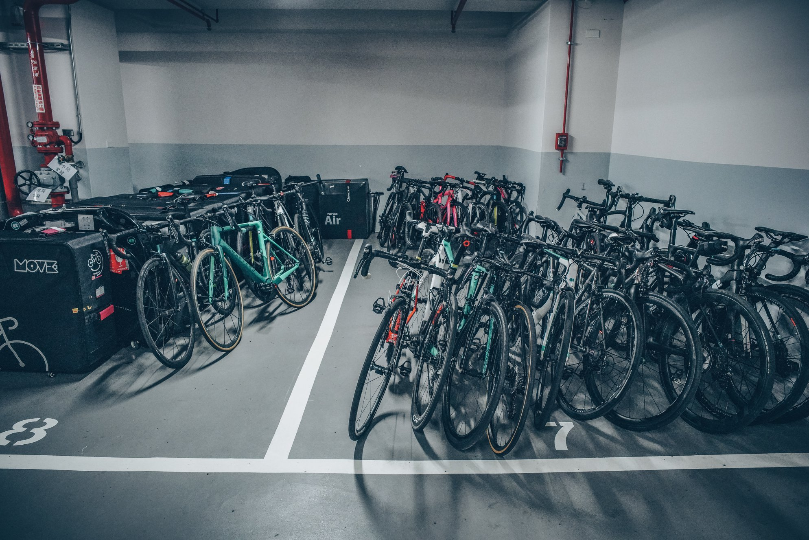</image-zoom>

<image-zoom caption="Name tags and feed bag were handed out to everyone at the start of the briefing.">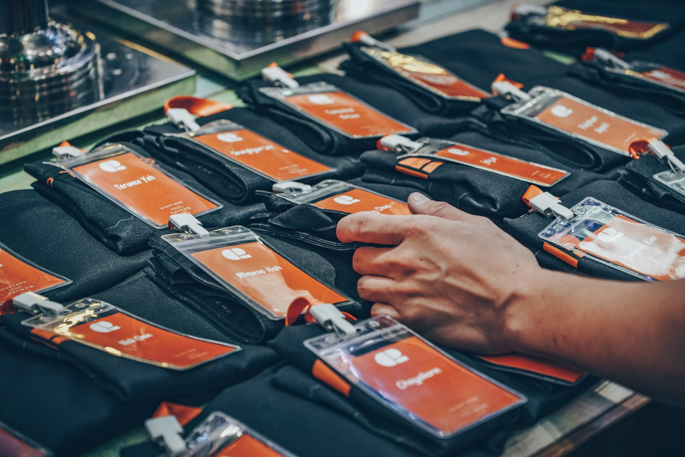</image-zoom>
<image-zoom caption="Yao from Yao Bike carefully briefed everyone on the 268km / 5600m elevation gain itinerary for the next 3 days. Everyone was 'stoked!'.">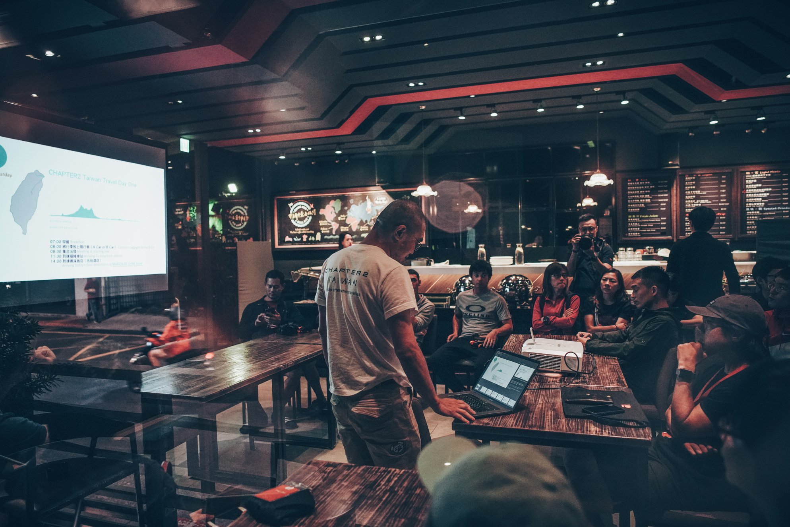</image-zoom>

## The next morning

After breakfast at the hotel restaurant, everyone gathered at the lobby around 8am for the departure. Everyone was friendly, excited but generally nervous about the next few days of riding. Even though we all knew the today was the easiest leg, we were mentally psyching ourselves up for day 2 & 3. Despite the language barrier between some of us, we all had a common goal: Making it up to Wuling.

<image-zoom >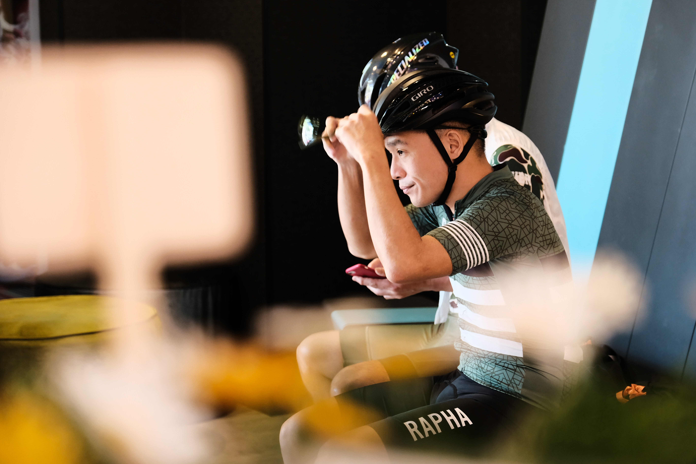</image-zoom>
<image-zoom ></image-zoom>

<image-zoom >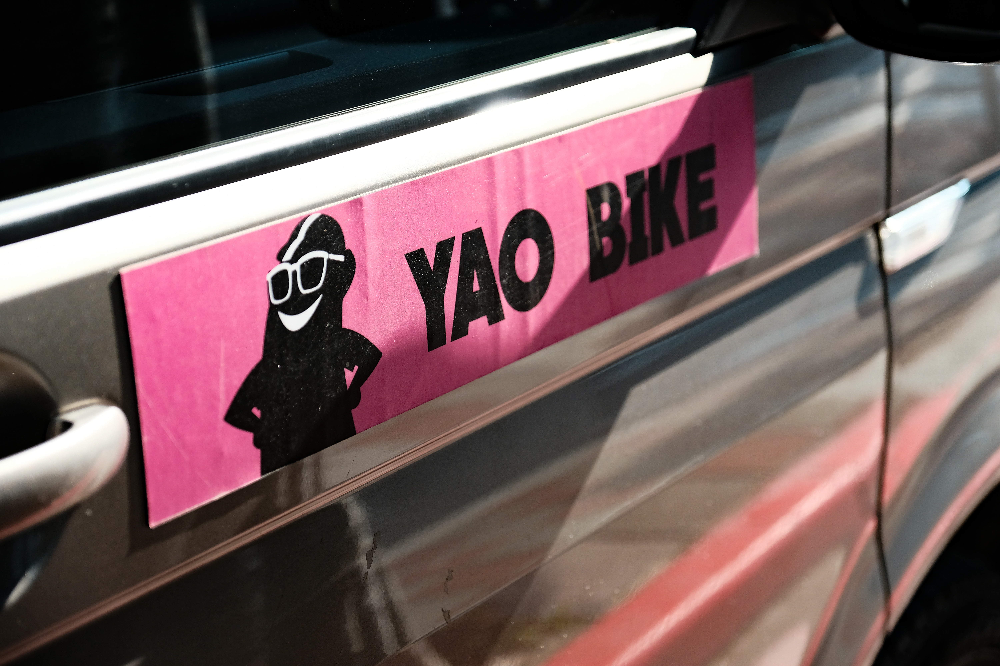</image-zoom>
<image-zoom ></image-zoom>

<image-zoom ></image-zoom>
<image-zoom ></image-zoom>

<image-zoom caption="30 riders from all over the world. We spoke different languages, had different background, but all shared the same goal - to conquer Wuling."></image-zoom>

Riding through Taipei city was fun, the roads weren't particularly busy. We kept the pace nice and steady, just slow enough to have a conversation with whoever's around you. This was nice because I didn't know anyone in the group.

<image-zoom ></image-zoom>

<image-zoom ></image-zoom>
<image-zoom >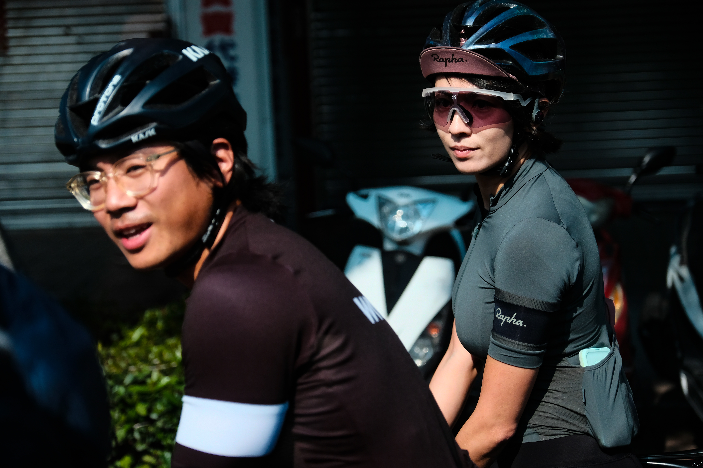</image-zoom>

<image-zoom >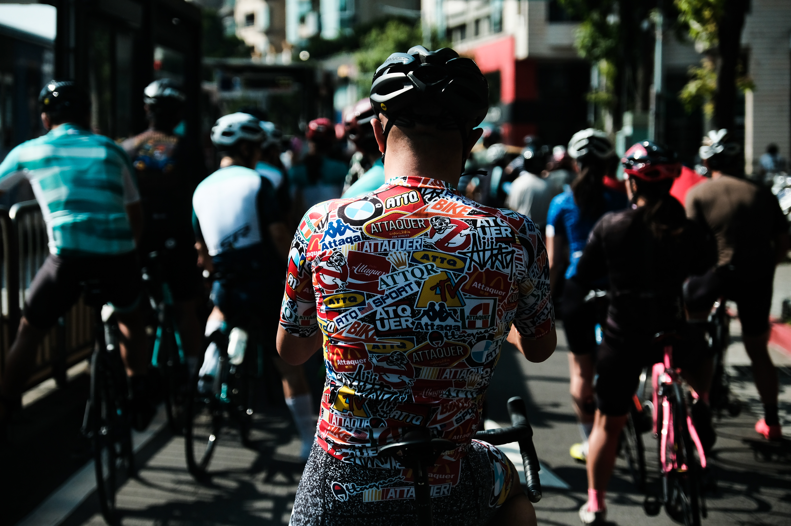</image-zoom>
<image-zoom >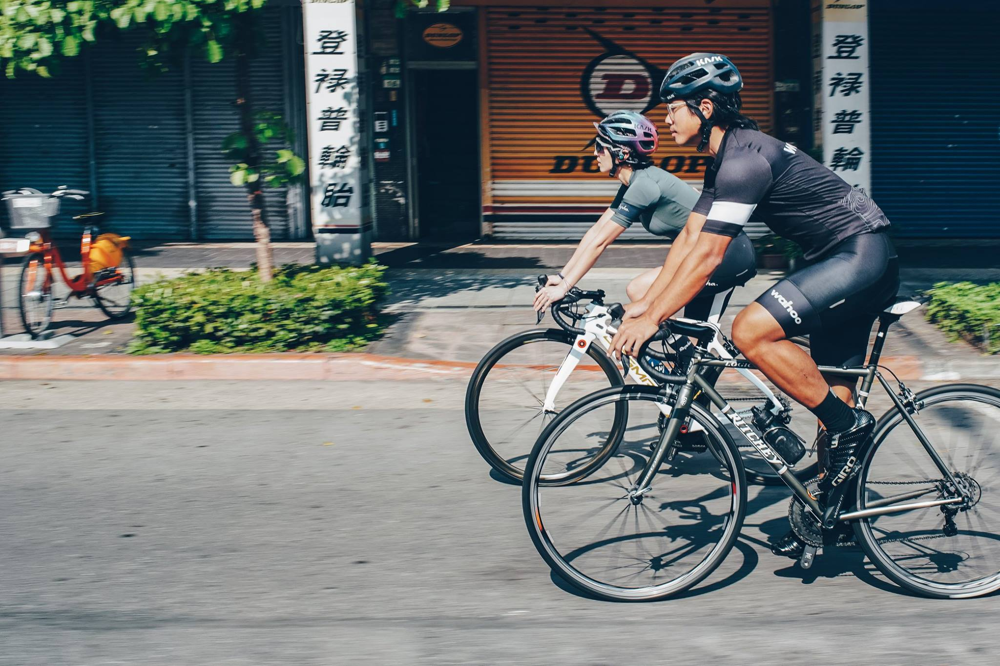</image-zoom>

Roughly 20km in, we began climbing out of Taipei, through Pingxi.

<image-zoom ></image-zoom>
<image-zoom ></image-zoom>

<image-zoom ></image-zoom>
<image-zoom >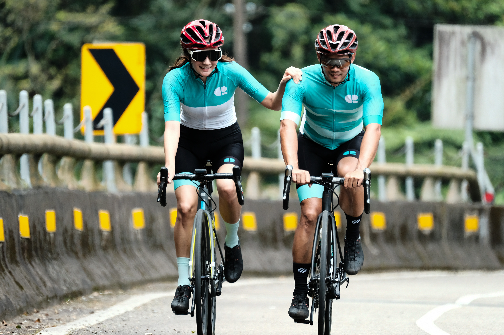</image-zoom>

<image-zoom ></image-zoom>

65km in we made a lunch stop at Fulong. then another slow & steady flat section into Yilan. In true Taiwanese spirit, we took a pitstop for some boba tea before heading into our accomodation.

<image-zoom >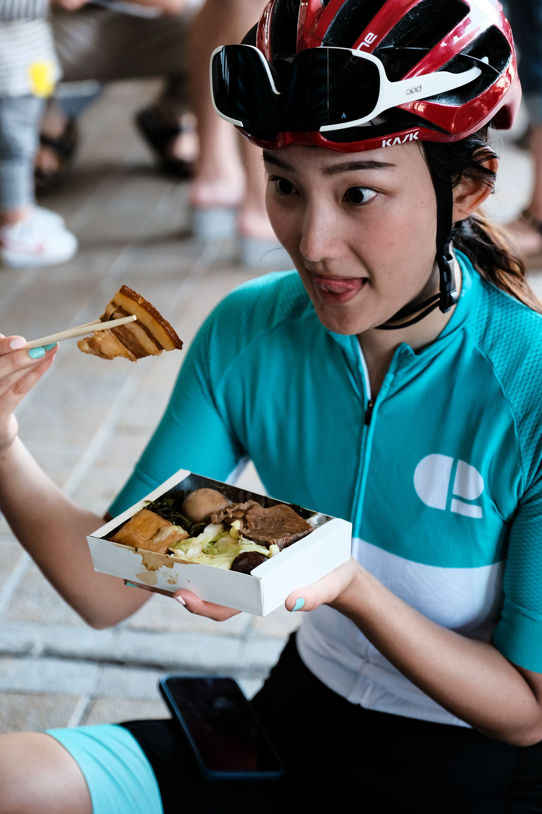</image-zoom>
<image-zoom >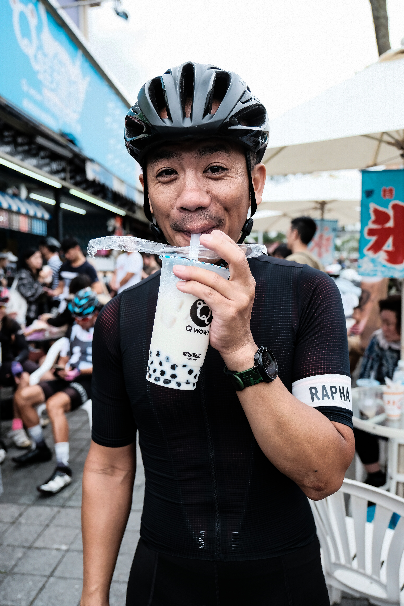</image-zoom>

<image-zoom ></image-zoom>
<image-zoom >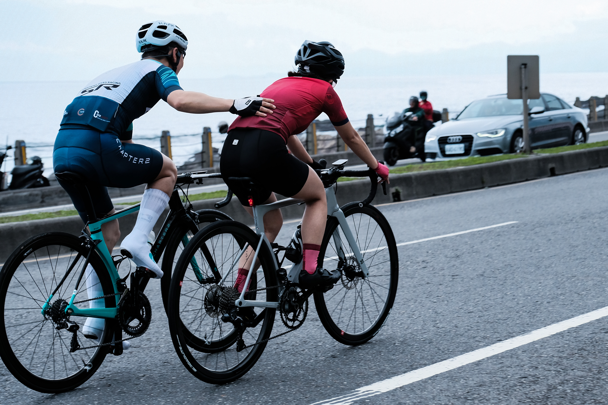</image-zoom>

<image-zoom ></image-zoom>
<image-zoom ></image-zoom>

<image-zoom caption='Boba stop is a must for any rides in Taiwan.'></image-zoom>

Some of us headed straight into the rooftop spa & pool at the hotel. We figured any sort of muscle recovery would be ideal for the brutal climbs for the next couple of days.
