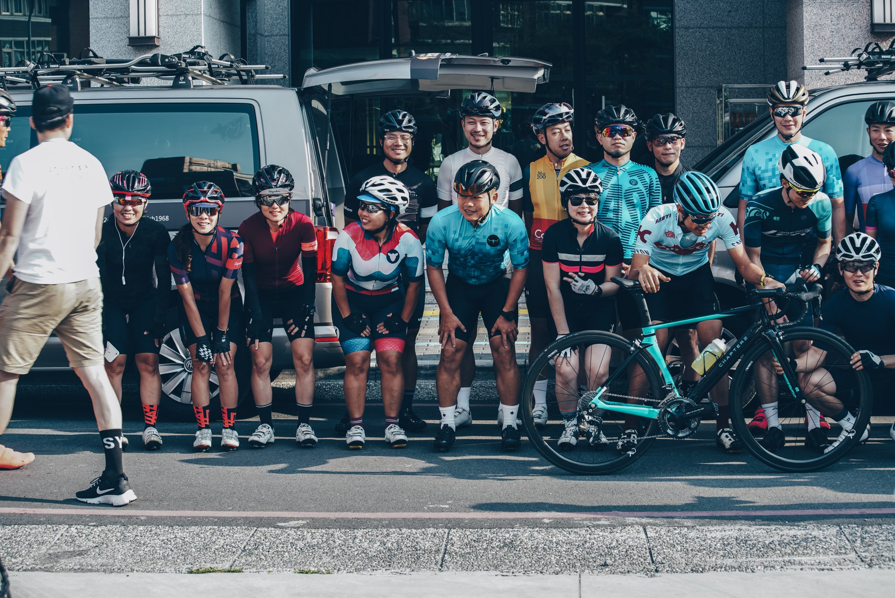
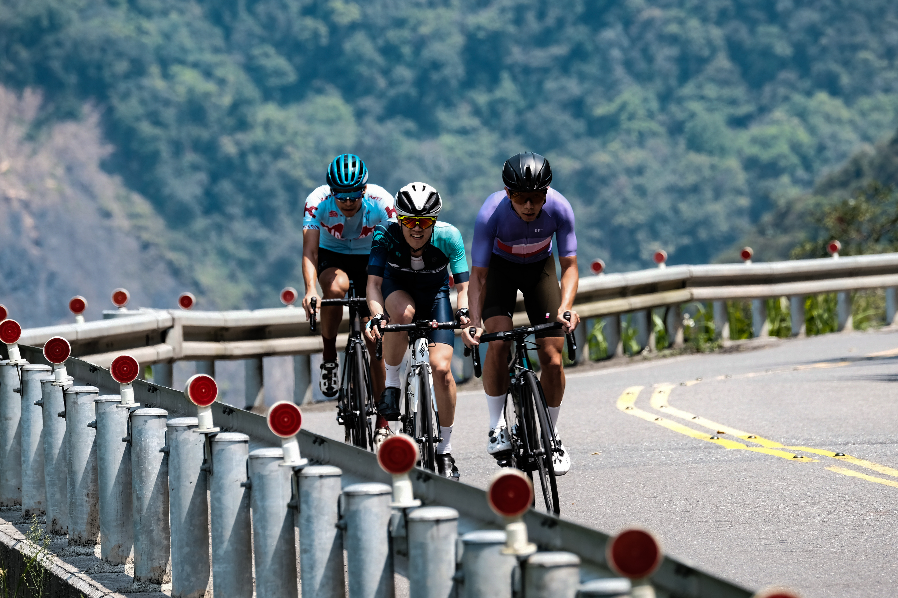

We had a lot of elevation to cover for day 2 so we departed from Yilan at 7:30 in the morning. Everybody looked fresh and stoked to tackle 100km / 2500m from Yilan to Wuling Farm.

<image-zoom caption="Everybody looked fresh and stoked to tackle 100km / 2500m from Yilan to Wuling Farm."></image-zoom>

20km in, the road began pointing upwards and the group started splitting. I held onto the wheels of the first group until I regretted the stupid decision. Kim (Chapter 2 distributor from Korea) and I decided to be sensible and peel off the back and ride at our own pace.

To regroup, we made our first pit stop 48km in at <marker-link lat='24.574972' lng='121.478008' label='A' zoom='16'>Datong Junior High School</marker-link>. Soft drinks and snacks were handed out, it was a much needed sugar top up because we still had about 2000m elevation to cover.

<image-zoom></image-zoom>

<image-zoom></image-zoom>
<image-zoom></image-zoom>

At 63km in, we made our second pit stop at <marker-link lat='24.487230' lng='121.426479' label='B' zoom='16'>Siji Elementary School</marker-link>. The sun was beating down and everyone was cooked!

<image-zoom caption="Everyone was cooked from the sun and constant climbing."></image-zoom>

## False flats

At this point, Terence warned me about what's coming up. He said we're about to enter a long stretch of false flats, and the climb is going to feel never-ending. He wasn't joking, riding through the section was torturous, but luckily I had Kim to keep me company.

<image-zoom></image-zoom>
<image-zoom></image-zoom>

<image-zoom></image-zoom>
<image-zoom></image-zoom>

<image-zoom caption="Kim and I suffered together on the same stretch of false flats and we instantly became the best of friends."></image-zoom>

## Lunch stop

The false flat section lasted for about 10km, then we all regrouped at a FamilyMart convenience store. Everyone was starving at this point, and inhaled everything we bought for lunch. I had some instant noodles, a banana and a hot long black coffee.

<image-zoom></image-zoom>
<image-zoom></image-zoom>

## Siyuan Yakou

After lunch, the road continues to kick upwards. This was the last stop before we reached the highest point of the day, at <marker-link lat='24.39693' lng='121.356936' label='C' zoom='16'>Siyuan Yakou</marker-link>. The group eventually turned into a string of riders, all grinding it to the top. Everyone was happy the hardest part of the day was over. It was all downhill from that point... for now.

<image-zoom></image-zoom>
<image-zoom></image-zoom>

<image-zoom></image-zoom>
<image-zoom></image-zoom>

<image-zoom caption="Everybody was stoked the hardest part of the day was over. It was all downhill from there... for now."></image-zoom>

