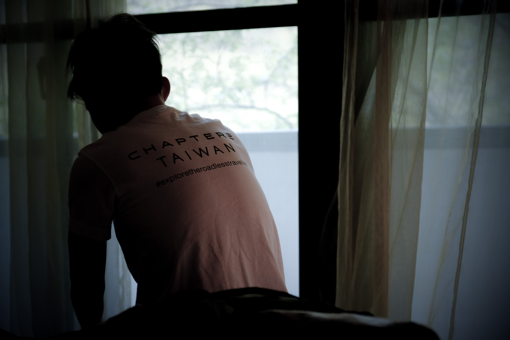
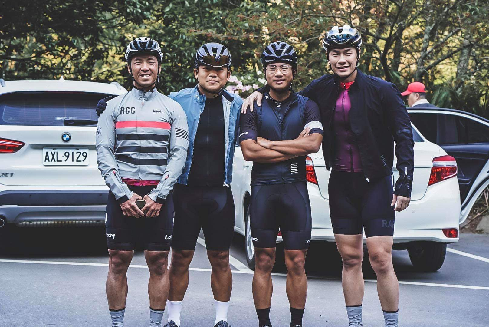
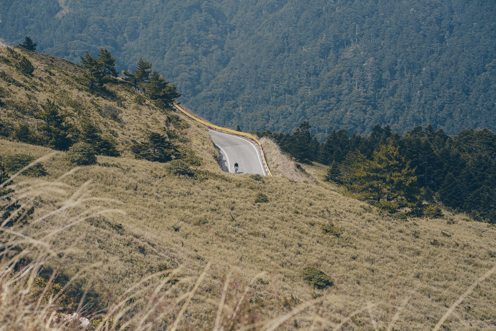
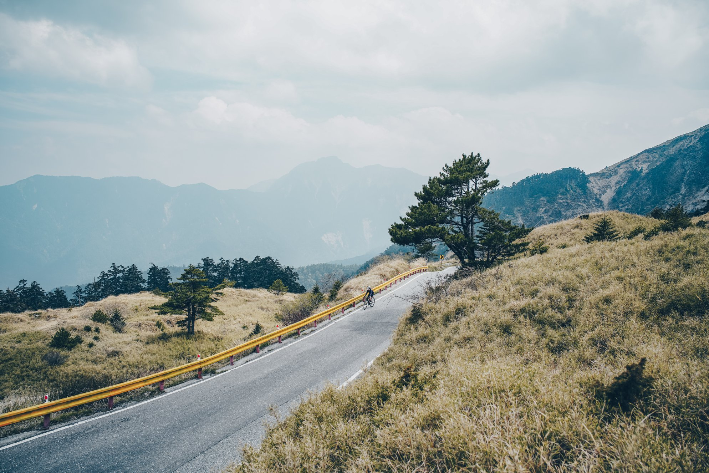
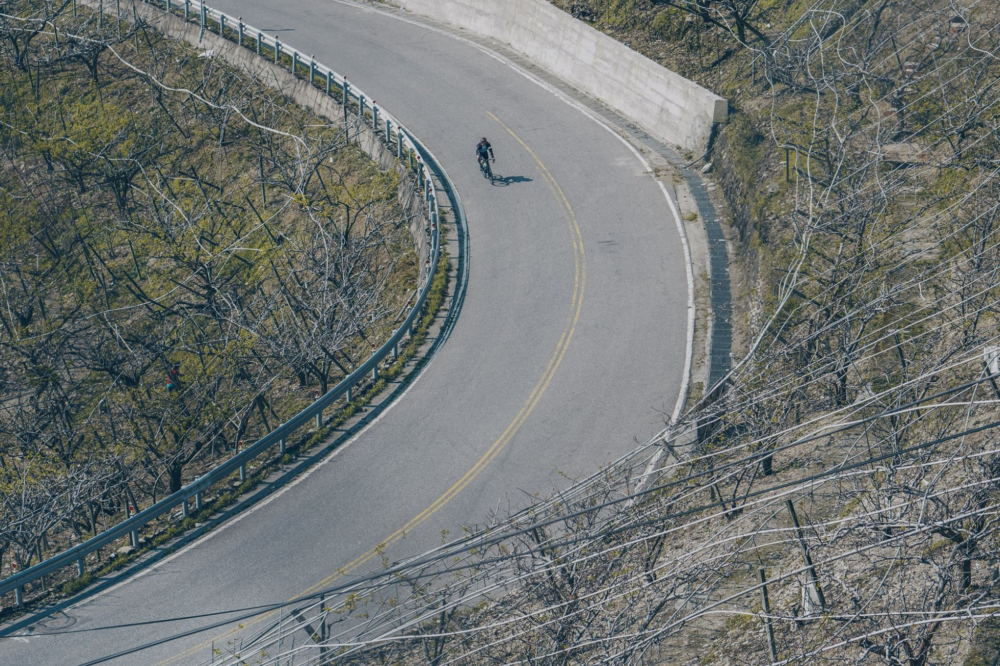
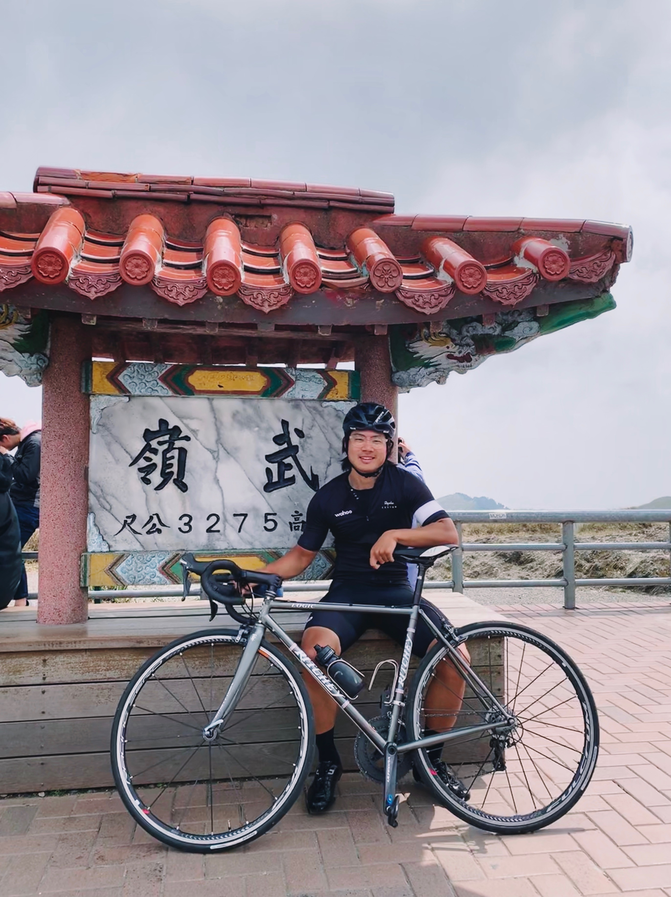
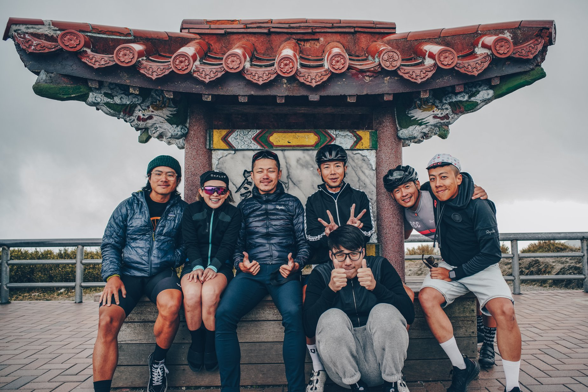
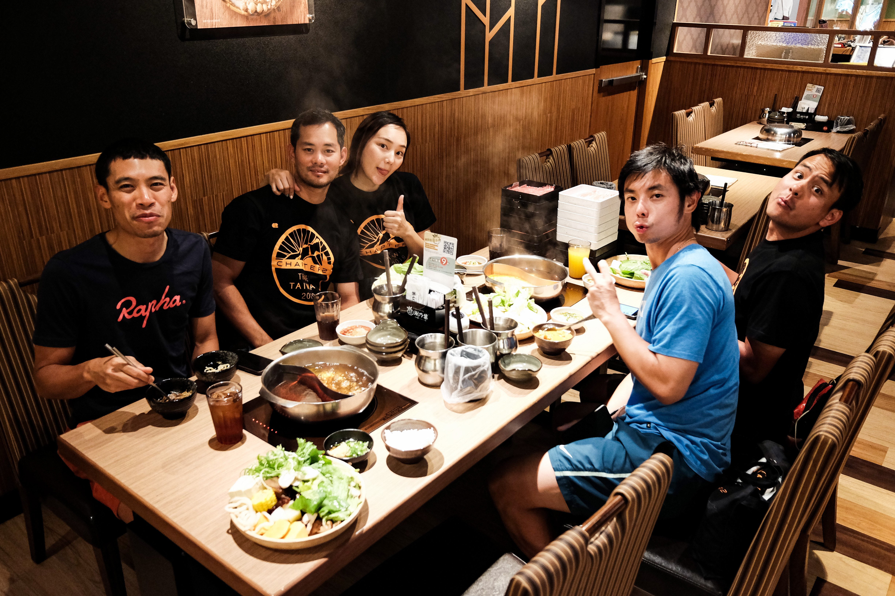
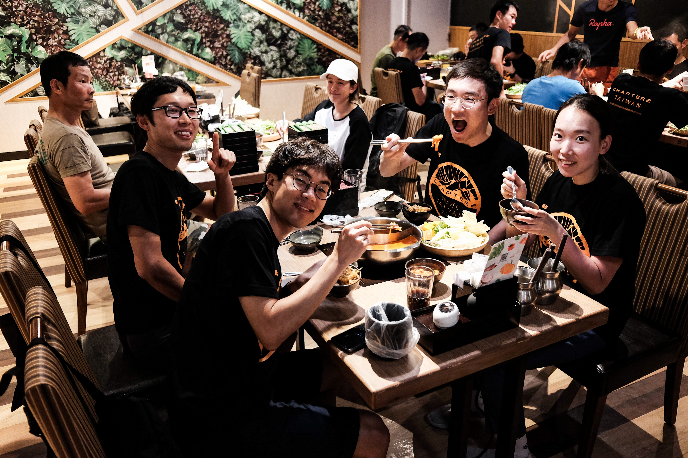
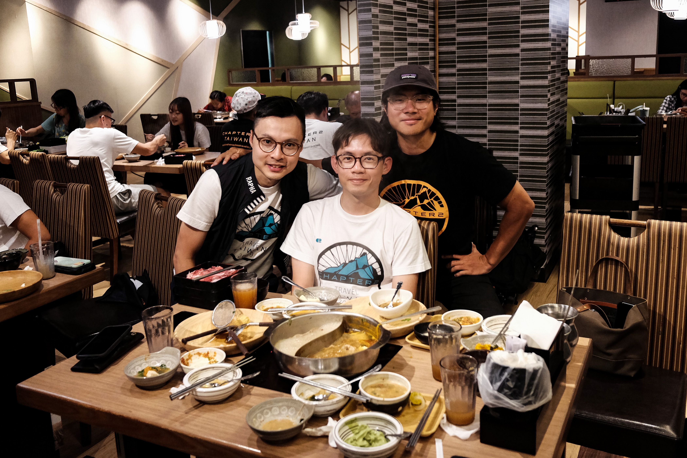

The final day of the trip came faster than I anticipated. Time certainly flies when you're having fun in the saddle. The morning began with breakfast at 7:00am, then meet up at 7:30pm for departure.

<image-zoom></image-zoom>
<image-zoom></image-zoom>

<image-zoom></image-zoom>
<image-zoom></image-zoom>

<image-zoom></image-zoom>

Word on the street (anyone that's done Wuling before) warned everyone to take it easy today. Pacing is critical to prepare yourself for the "last 10km". The "last 10km" came up multiple times this trip. Poetically they called it 天堂路(Road to Heaven) and it's the section before summiting Wuling, the highest road in Taiwan.

The air at 1700m elevation was chilly in the morning. We departed at an easy pace, and began with 300m of climbing.

<image-zoom caption="Everyone played it safe, saving enough energy for the last 10km"></image-zoom>

## 清泉橋

At 14km in, we made a brief stop at <marker-link lat='24.297262' lng='121.280214' label='A' zoom='13'>清泉橋</marker-link>. This bridge was built by the French in 1954, a popular destination for anyone travelling through here.

<image-zoom caption="清泉橋"></image-zoom>

From here it was a steady 4% hill without too many sharp pinches.

<image-zoom></image-zoom>
<image-zoom></image-zoom>

## Dayuling

[Jay](https://www.instagram.com/ecboyy/), [Terence](https://www.instagram.com/terence.yeh/) and I found ourselves pacing nicely in the same bunch. It didn't take long before we reached the tunnel. This tunnel in <marker-link lat='24.180848' lng='121.309831' label='B' zoom='13'>Dayuling</marker-link> marks the beginning of the "last 10km". Some of us took a toilet stop for some strategic offload. I swallowed my last energy bar, hoping I don't ever need to do the walk of shame.

<image-zoom caption="This tunnel marks the beginning of the 'last 10km'"></image-zoom>
<image-zoom></image-zoom>

## The last 10KM

Immediately after we made a right turn after the tunnel, the road kicked straight up to a whopping 11%, and stayed there. It was like staring at a merciless wall. I found myself looking away at what's ahead, staring at my handlebar was far less intimidating.

The hairpins here were the steepest I have ever ridden, sometimes at 20% at certain areas, where I had to do the delicate balance of wheelie vs. spinning out. To make things even harder, the high altitude made if difficult to breath, and my heart rate peaked only at 160. Each pedal felt heavier than usual. Fortunately Terence was my climbing buddy for the day, I don't know how he's doing this on a size 28 cassette, bloody insane.

<image-zoom caption="Terence, my climbing buddy."></image-zoom>

<image-zoom></image-zoom>
<image-zoom></image-zoom>

<image-zoom></image-zoom>
<image-zoom></image-zoom>

<image-zoom></image-zoom>
<image-zoom></image-zoom>

<image-zoom></image-zoom>
<image-zoom></image-zoom>

<image-zoom></image-zoom>

## Wuling

After an hour of agony, Terence and I finally made it to the summit. The pilgrimage was complete, and I couldn't tell if my tears were from joy or the unforgiving freezing wind at 3275m elevation.

<image-zoom caption="Taking a photo with this signage is a must if you make it up here."></image-zoom>

Today was a massive success, the pilgrimage to <marker-link lat='24.137157' lng='121.275718' label='C' zoom='12'>Wuling</marker-link> was as tough as advertised. I can't imagine having to race the 100km from sea level to here. This was a humbling experience, and it's motivating me to train harder, so one day I can attempt the [Taiwan KOM](https://www.youtube.com/watch?v=Sxfd2xzlM6k).

<image-zoom></image-zoom>
<image-zoom caption="Everybody was stoked to have completed the challenge, but a huge 'fuck you' to the organiser Yao for organising such a torturous route!"></image-zoom>

From there, we had 4 support vans that drove everyone down to Taichung, where we had a deserving hot pot dinner.

<image-zoom caption="All of our bikes went on the support vans. The ride down to Taichung took 2 hours."></image-zoom>

<image-zoom caption="Team Thailand"></image-zoom>
<image-zoom caption="Team Korea"></image-zoom>
<image-zoom caption="A massive kudos to our photographers Dominic and C.j for the trip. They made us look good!"></image-zoom>

## Special mentions

This trip wouldn't have been possible by the amazing crew & photographers who organised an entire 5 days itinerary.

- [Yao Bike](https://www.facebook.com/yaobike/)
- [Domho://Photography](https://www.facebook.com/domhosports)
- [C.j. Lin](https://www.facebook.com/chunju.lin.315)

## Photography credit

Photos from this entry by [Domho://Photography](https://www.facebook.com/domhosports) and [C.j. Lin](https://www.facebook.com/chunju.lin.315)
