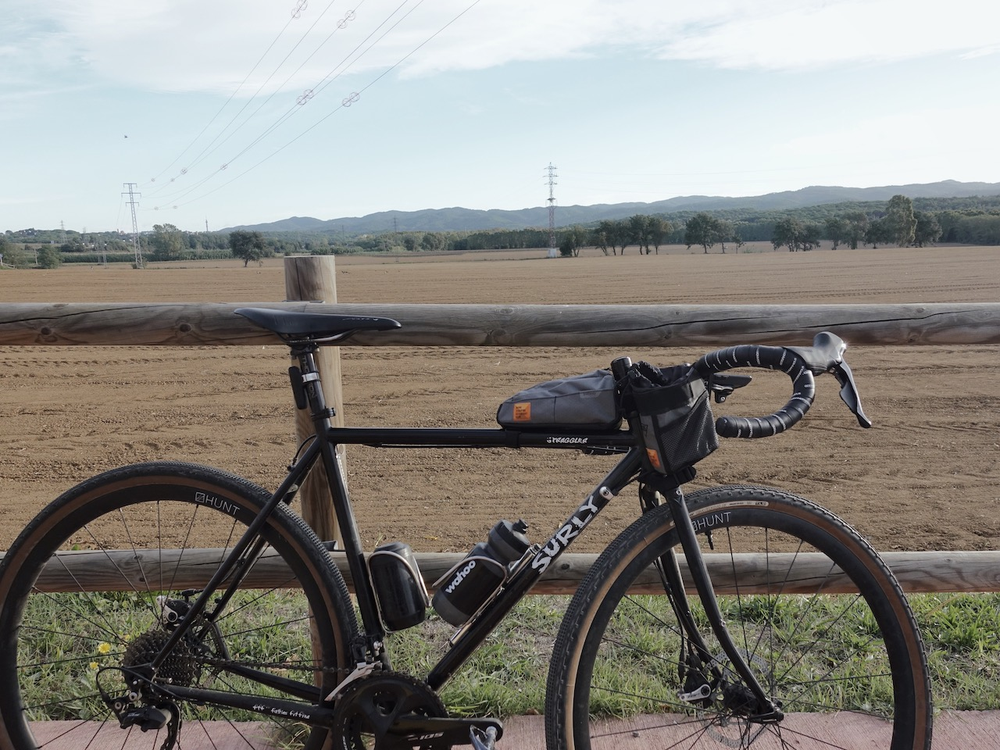
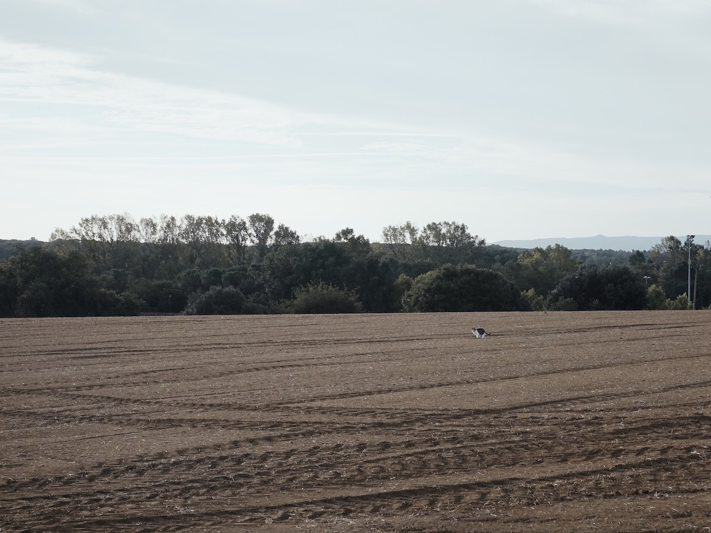
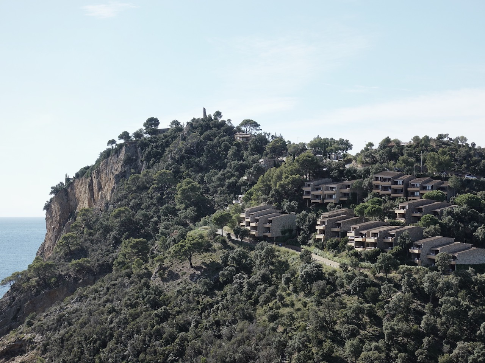
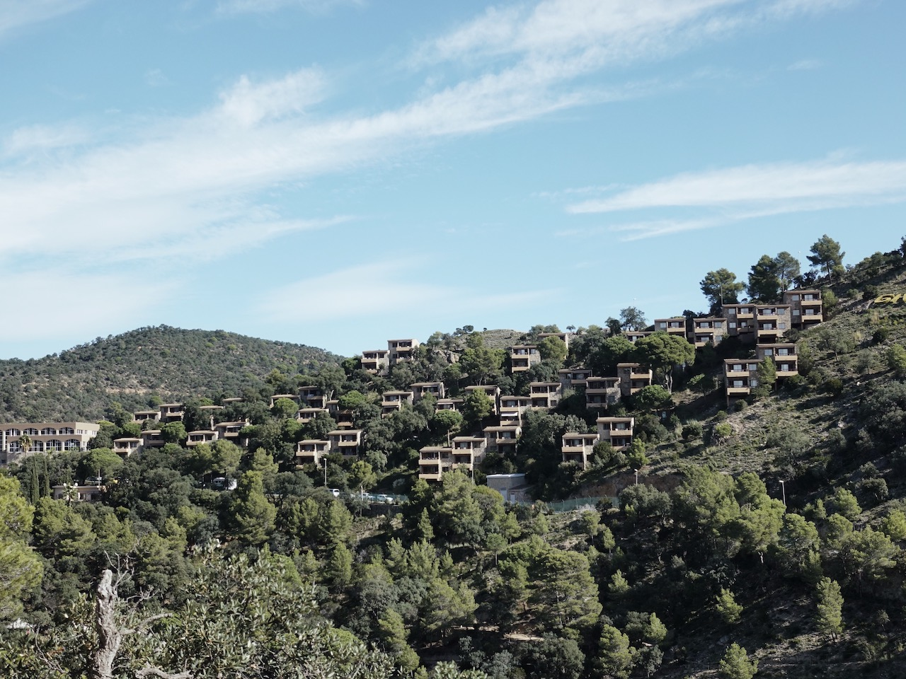
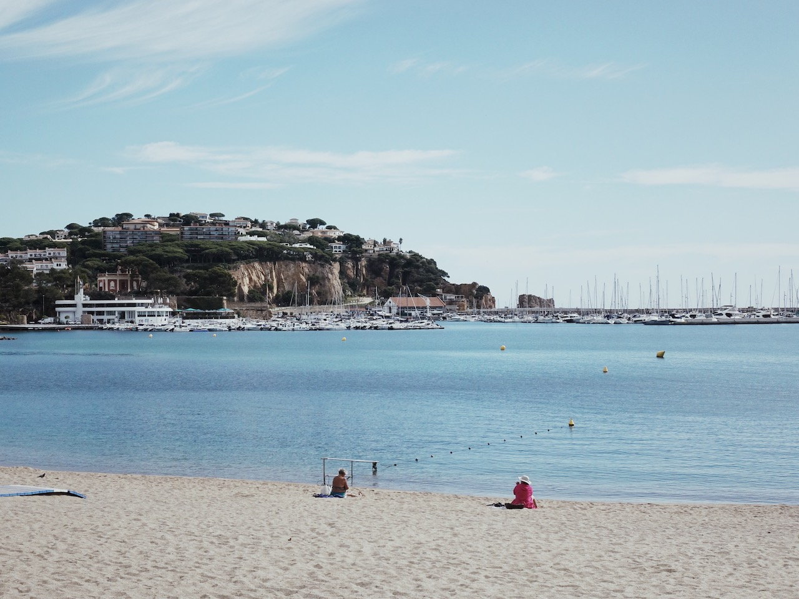
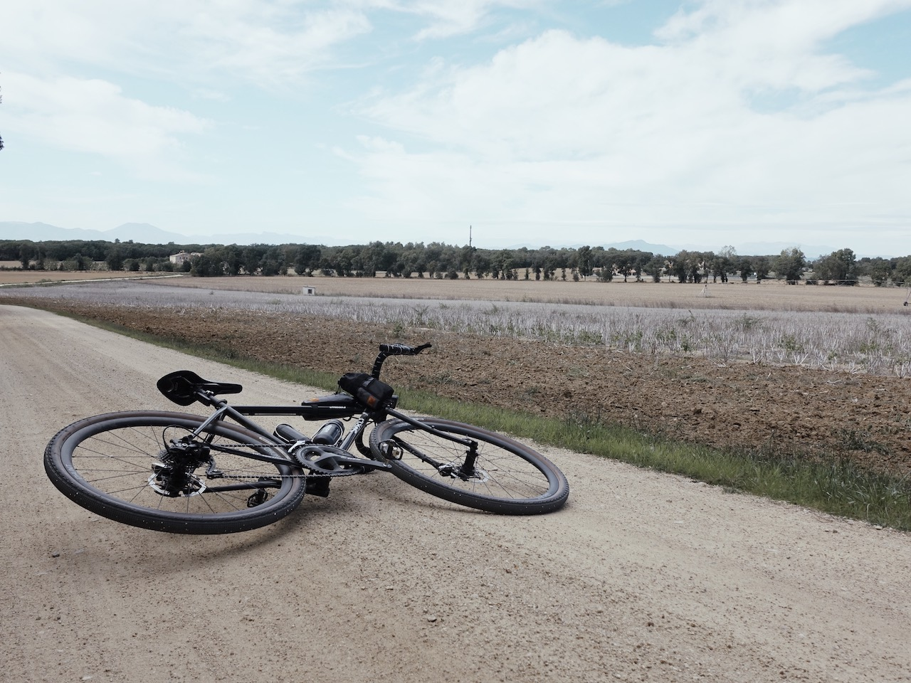
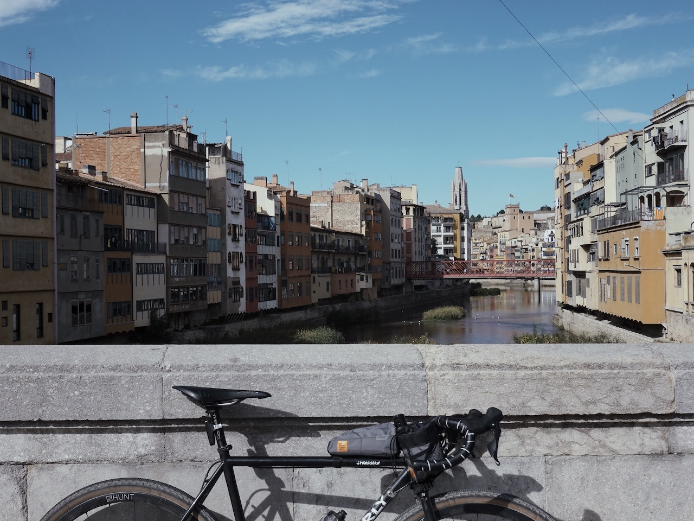

Making the most of my last weekend in Europe, I hopped down to Barcelona for 4 days. During one of those days, [Katia](https://www.instagram.com/katiaishere/) recommended me to go for a ride in Girona in north eastern Spain.

I took an early train and arrived in Girona at 8:15am. Feeling dusty, I headed straight to <marker-link lat='41.984166' lng='2.824055' label='A' zoom='16'>Coffee & Greens</marker-link> for a coffee and croissant. Just as I took my first sip of the flat white, [Jimmy Whelan](https://www.instagram.com/jimmywhelan.jpg/) from EF Education First pulls up outside the shop. I guess it's true that many pro cyclists live in Girona...

<image-zoom></image-zoom>

After coffee I began the ride for the day. It was stunning in every way. I kept making photo stops to try and capture the moments, especially along the coastal roads looking out to the Balearic Sea. My photos could never do them justice so please go and experience it yourself if you can!

<image-zoom></image-zoom>
<image-zoom></image-zoom>

<image-zoom></image-zoom>
<image-zoom></image-zoom>

<image-zoom></image-zoom>

<image-zoom></image-zoom>
<image-zoom></image-zoom>

# Tossa de Mar

The climb out of Tossa de Mar was one of the most enjoyable moments of the entire ride. Looking out over <marker-link lat='41.716681' lng='2.933623' label='A' zoom='14'>Muralla de Tossa de Mar</marker-link> was a treat.

<image-zoom caption='Looking out to Muralla de Tossa de Mar'></image-zoom>

<image-zoom></image-zoom>
<image-zoom></image-zoom>

<image-zoom caption='Giverola Resort'></image-zoom>
<image-zoom></image-zoom>

## Sant Feliu de Guíxols

70 km in, I stopped at Sant Feliu de Guíxols for a <marker-link lat='41.780881' lng='3.032812' label='C' zoom='14'>lunch break</marker-link>. Looking out onto the beach front, I carbed loaded on some pasta and radler.

<image-zoom></image-zoom>
<image-zoom></image-zoom>

Coming back to Girona, I went through a really nice dirt road <marker-link lat='41.871314' lng='2.864842' label='D' zoom='14'>Cassà de la Selva</marker-link>. I made it back to Girona about 4pm, and took the train back to Barcelona at 5pm.

<image-zoom></image-zoom>

<image-zoom></image-zoom>
<image-zoom></image-zoom>

<image-zoom caption='Back in Girona, Pont de Pedra at 4pm'></image-zoom>

