This being my first time in Europe, I didn't want to leave without doing a multi-day bikepacking trip somewhere. I had a vague idea of riding from Amsterdam to Paris, but didn't start planning anything until one week before the departure. Triggered by a _mid winter depression_ in the southern hemisphere, a friend from Melbourne, [Ian](https://www.instagram.com/djiwan/), decided to join in on the adventure. He arrived on Thursday evening, and we departed on the following Saturday.

Since we're in the land of the flat, I planned to ride 550km over 3 days. We booked some Airbnbs for each night and that was the full extent of the planning – I put a lot of faith into [Komoot](https://www.komoot.com) because I did absolutely zero investigation on the route it generated for us 🙃.

**Day 1: Amsterdam to Antwerp**

<iframe src="https://www.komoot.com/tour/91796504/embed" width="100%" height="400" frameborder="0" scrolling="no"></iframe>

**Day 2: Antwerp to Saint Quentin**

<iframe src="https://www.komoot.com/tour/91796726/embed" width="100%" height="400" frameborder="0" scrolling="no"></iframe>

**Day 3: Saint Quentin to Paris**

<iframe src="https://www.komoot.com/tour/91798136/embed" width="100%" height="400" frameborder="0" scrolling="no"></iframe>

Packing for 3 days in summer was easy. Amsterdam was still warm during the day, and it will only get warmer as we headed south.

<image-zoom>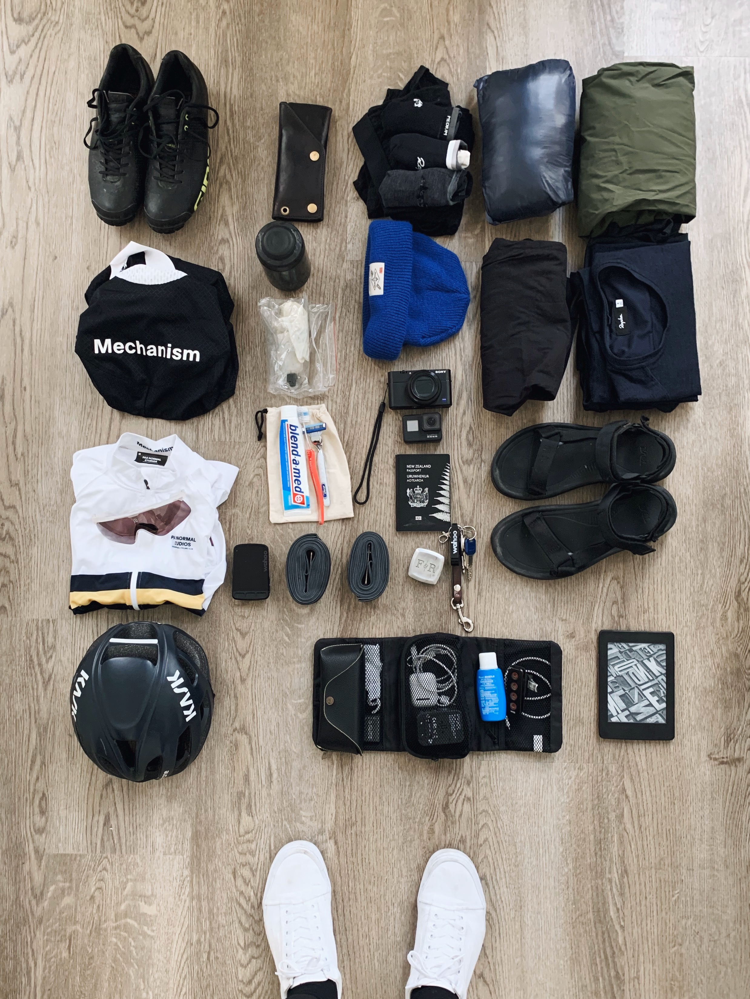</image-zoom>
<image-zoom>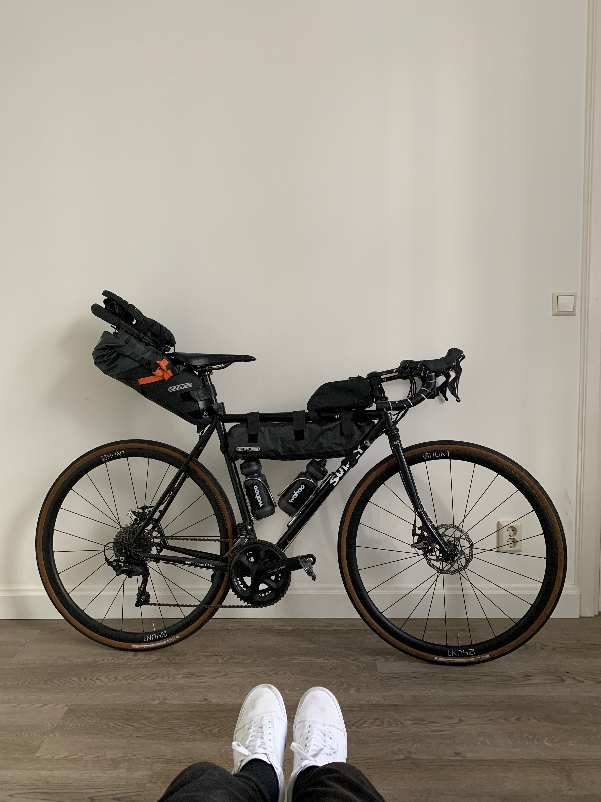</image-zoom>

# Bike lanes galore

Riding south to the border between Netherlands and Belgium was amazing, because dedicated bike lanes paved the entire way. Better yet, they have under river <marker-link lat='51.834557' lng='4.514594' label='B' zoom='16'>tunnels</marker-link> for bikes...

<image-zoom></image-zoom>
<image-zoom>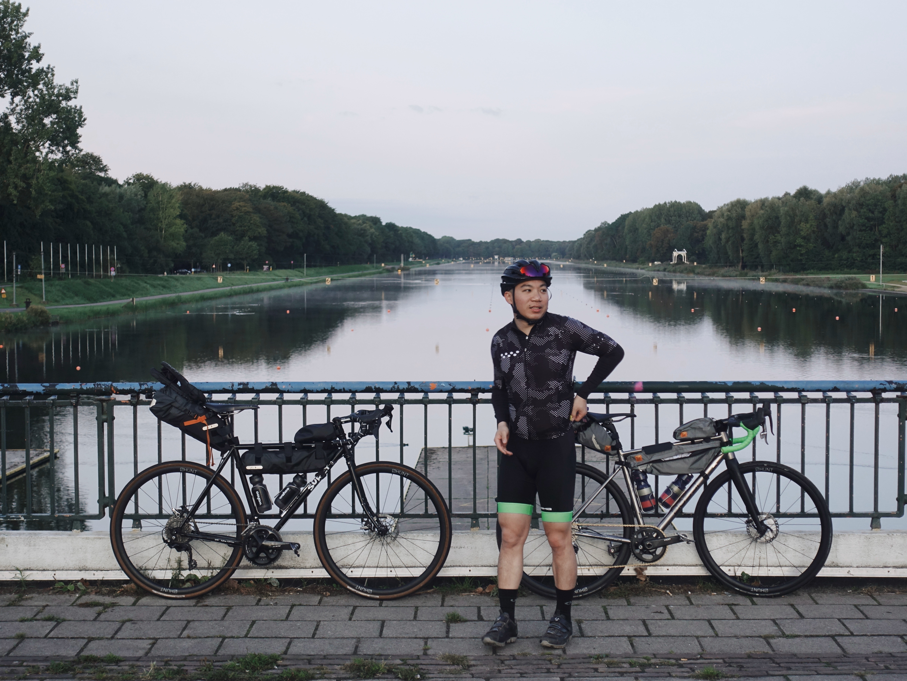</image-zoom>

<image-zoom caption="A bike lane tunnel that runs underneath the Oude Maas River">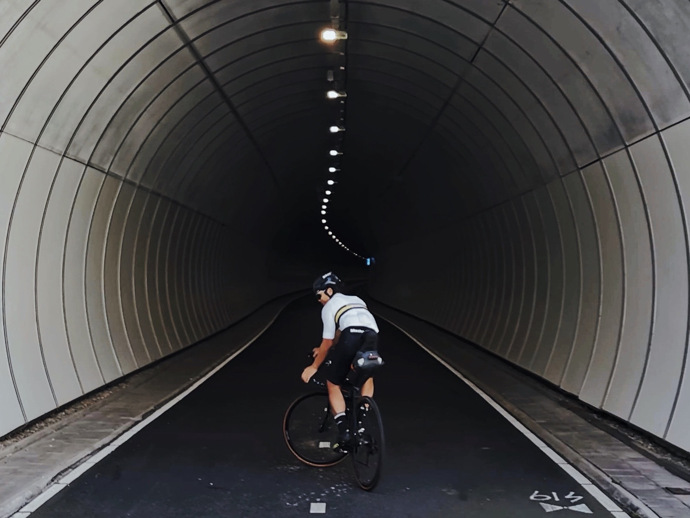</image-zoom>

<image-zoom>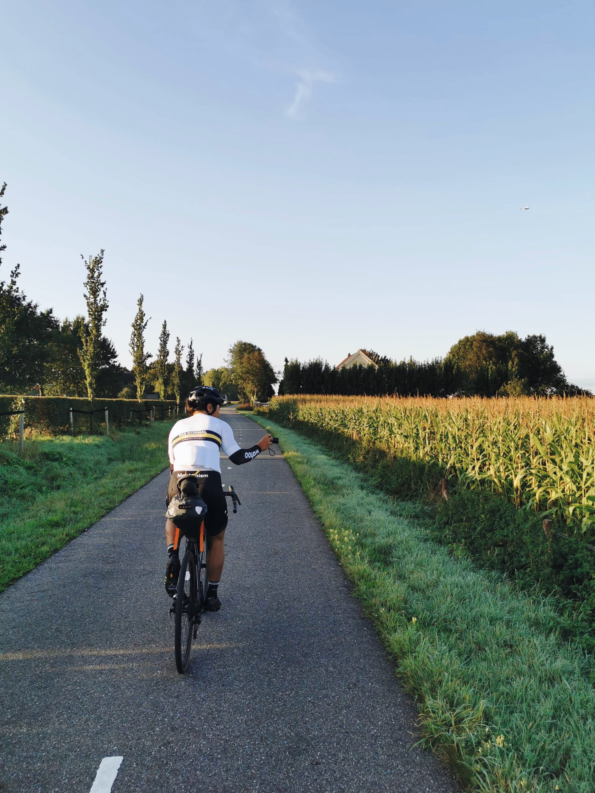</image-zoom>
<image-zoom>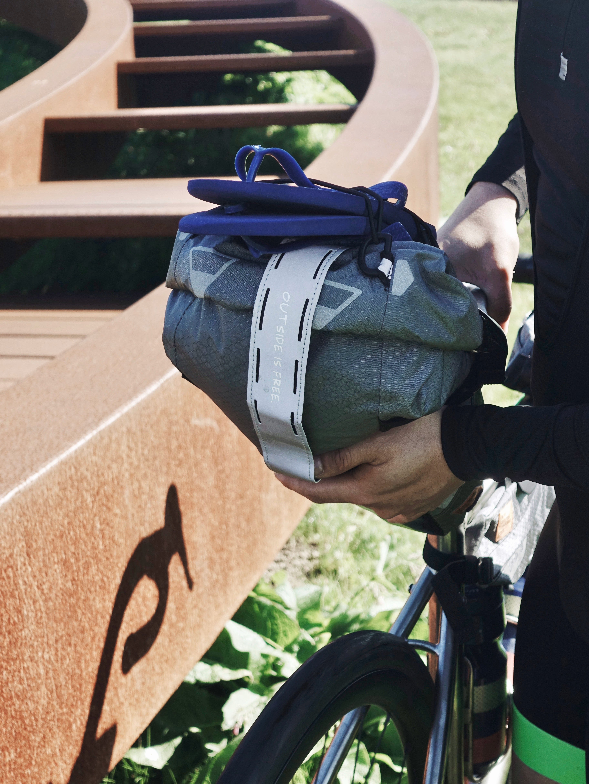</image-zoom>

<image-zoom>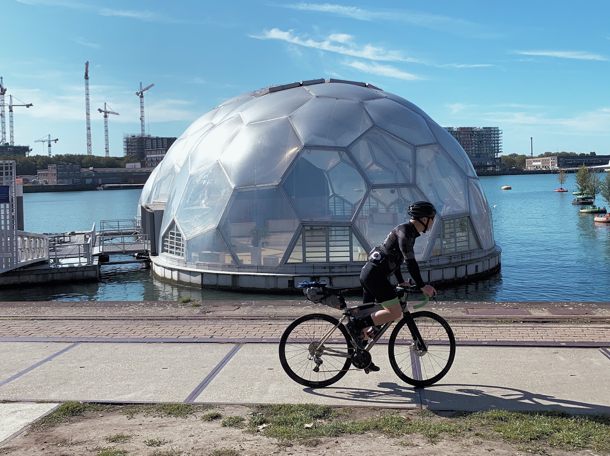</image-zoom>
<image-zoom caption="Markthal Rotterdam / MVRDV">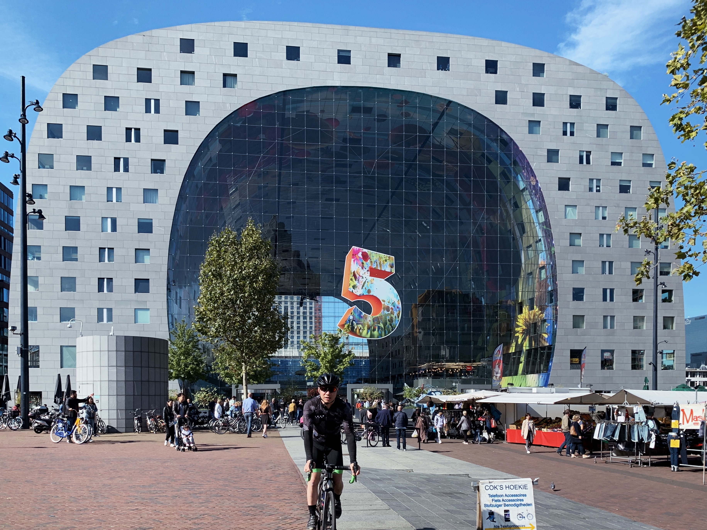</image-zoom>

<image-zoom caption="'The Elastic Perspective' by Next Architects">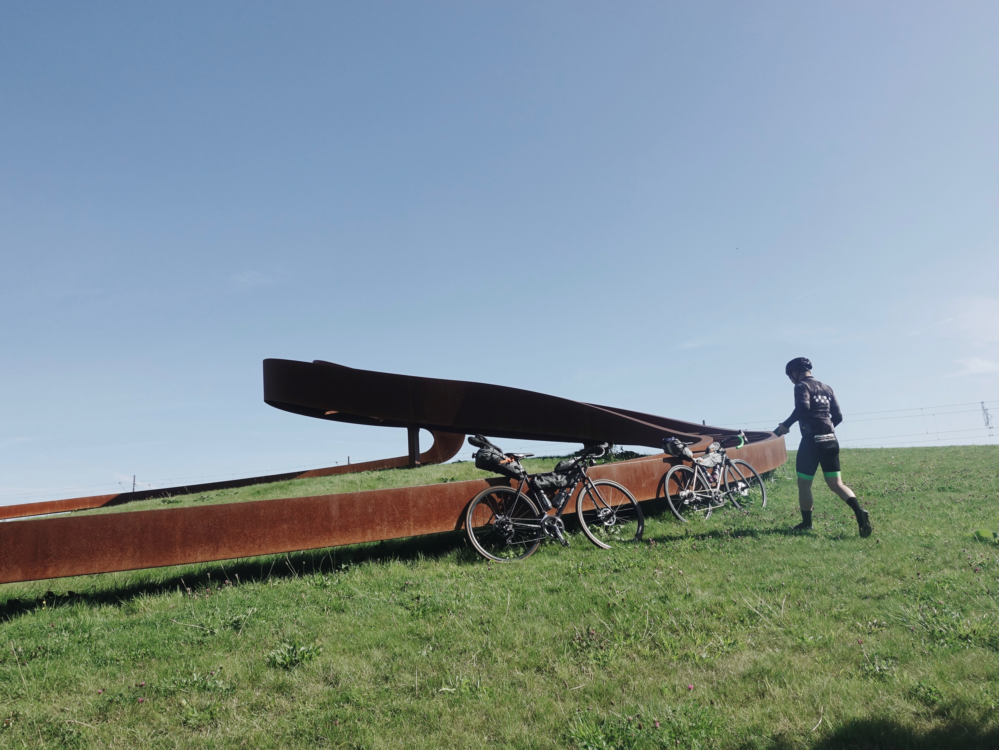</image-zoom>

# Arriving Antwerp

We arrived at Antwerp around 4pm, checked into our Airbnb, then headed out to meet [Nicolas](https://www.instagram.com/nicoloi/), a long time insta friend who's a local. He kindly showed us around his favourite stomping grounds in the old city of Antwerp, where we bonded over dinner & the finest belgium beers 💯🍻.

<image-zoom>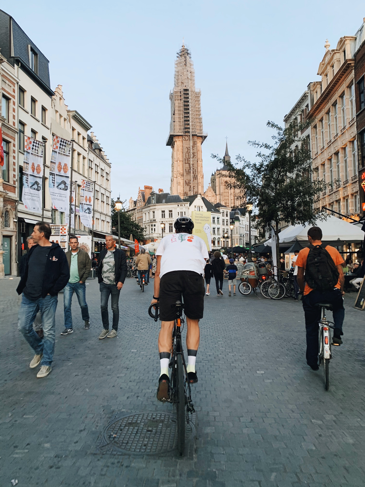</image-zoom>
<image-zoom>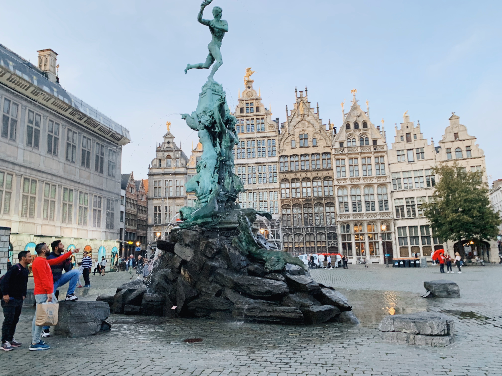</image-zoom>

<image-zoom>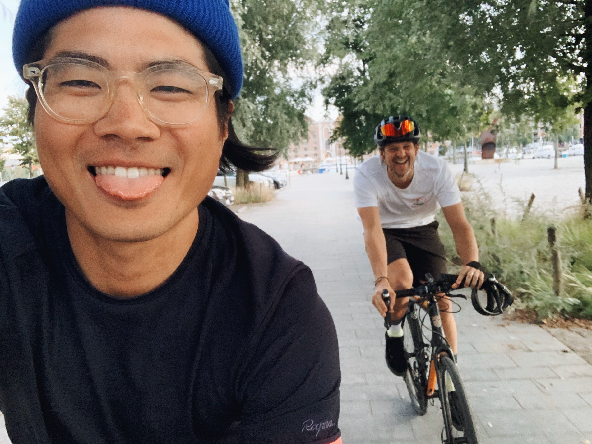</image-zoom>
<image-zoom>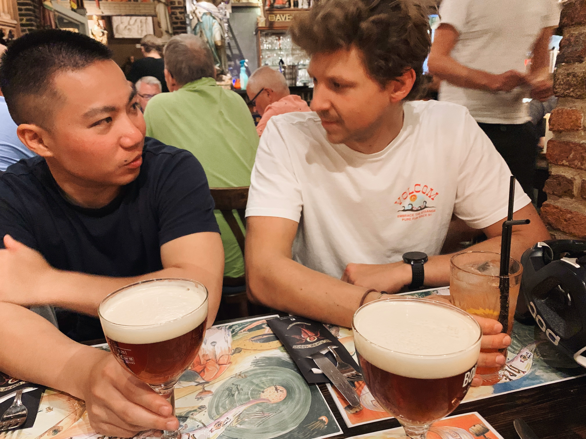</image-zoom>

