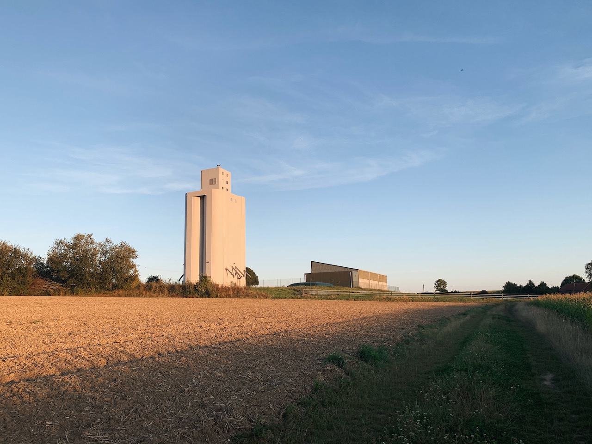

Ian and I departed for Saint Quentin on the second day. This was the longest leg of the trip, 235km. We were out the door at 6am on the dot, and decided to skip breakfast and head straight to Ghent (60km in) for a hearty breakfast.

The morning segments from Antwerp to Ghent was spectacular. We were early enough to ride through the lingering morning mist.

<image-zoom></image-zoom>
<image-zoom></image-zoom>

<image-zoom></image-zoom>
<image-zoom caption="Early morning mist in Antwerp"></image-zoom>

## Ghent

We rolled into <marker-link lat='51.054479' lng='3.716493' label='A' zoom='14'>Ghent</marker-link> around 10am and headed straight to a big breakfast. I picked up a bag of dates, bananas for the road, and took a short detour through the town center, before heading back on the road again.

<image-zoom></image-zoom>

<image-zoom></image-zoom>
<image-zoom></image-zoom>

## Oudenaarde

90 km in, we came across a quaint town. Not sure what the occasion was, but there were a lot of donkeys & horses on the main roads.

<image-zoom></image-zoom>
<image-zoom></image-zoom>
<image-zoom></image-zoom>

## Tournai

130 km in, we arrived at Tournai. We started to think every European town is starting to look the same – Big church with a big square in front.

<image-zoom></image-zoom>
<image-zoom></image-zoom>

## Trouée d'Arenberg

We couldn't ride through Belgium without paying a visit to the <marker-link lat='50.405804' lng='3.405796' label='B' zoom='13'>famous</marker-link> [Trouée d'Arenberg](https://www.youtube.com/watch?v=LKmyrZX5G_c) of Paris Roubaix!

<image-zoom></image-zoom>

<image-zoom></image-zoom>
<image-zoom></image-zoom>

## Saint Quentin

After pretending to be Peter Sagan racing on the cobbles of Arenberg, we pushed on to our destination of the day – Saint Quentin.

<image-zoom></image-zoom>

<image-zoom></image-zoom>
<image-zoom></image-zoom>

<image-zoom></image-zoom>
<image-zoom></image-zoom>

<image-zoom></image-zoom>
<image-zoom></image-zoom>

<image-zoom></image-zoom>
<image-zoom></image-zoom>

<image-zoom></image-zoom>
<image-zoom></image-zoom>

