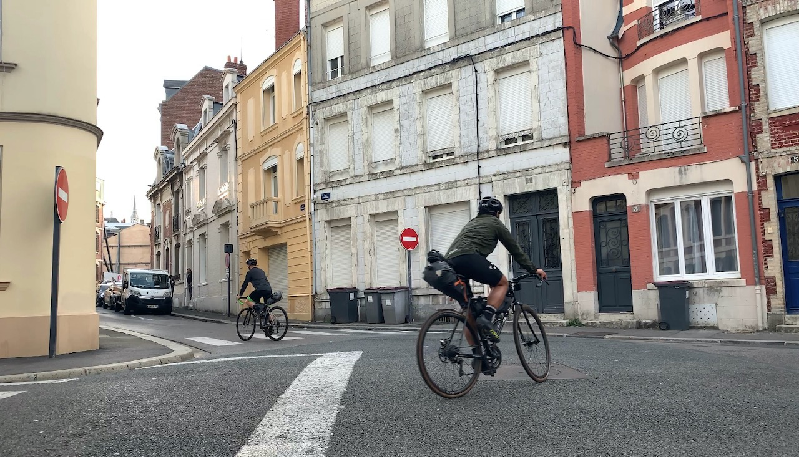
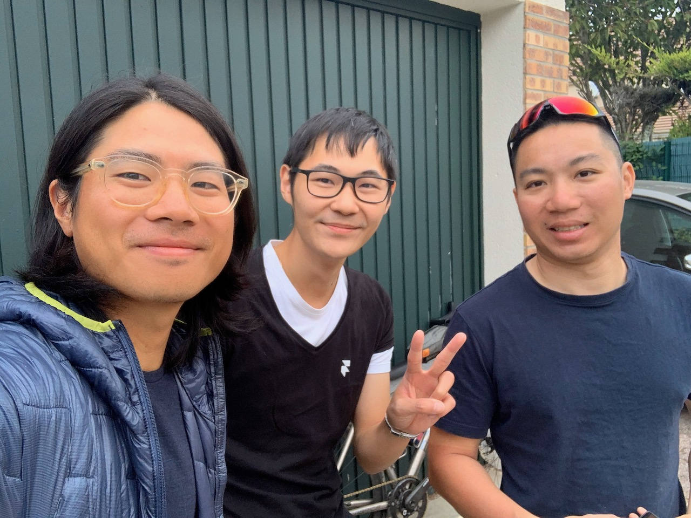

After the longest leg from the previous day, we decided to treat ourselves with a bit of snoozing in and begin riding at 8am. We only had to cover 150 km, we thought it would be a piece of cake and we'd make it into Paris by early afternoon. Little did we know Komoot would surprise us with some sketchy sand paths that made us walk our bikes, which added 2 hours to our original schedule.

<image-zoom caption='Rolling out of our Airbnb in Saint Quentin'></image-zoom>

<image-zoom caption='But first, espresso & bagels'></image-zoom>
<image-zoom caption='But first, espresso & bagels'></image-zoom>

After coffee & bagels, we set off for our final destination — Paris. Ian's legs felt good that day, mind didn't. But I was looking forward to a celebratory beer in Paris, so that kept me going.

<image-zoom></image-zoom>
<image-zoom></image-zoom>

<image-zoom></image-zoom>
<image-zoom></image-zoom>

## Noyon

40 km in, we stopped by Noyon to get some food at <marker-link lat='49.581520' lng='2.998968' label='A' zoom='14'>Le Galway Pub</marker-link> where we binged on buttery olives and a cheeky pint of IPA.

<image-zoom></image-zoom>

<image-zoom></image-zoom>
<image-zoom></image-zoom>

## Senlis

105 km in, we started feeling peckish, so stopped at another pub in Senlis. Feeling [boujee](https://tenor.com/yAPp.gif), we got beef tartare and a sandwich. It was bloody good.

<image-zoom></image-zoom>

<image-zoom></image-zoom>

## Oh Komoot

Post stuffing our face with delicious food, we gave ourselves the biggest pat on the back thinking the last 50 km into Paris would be breezy. Oh boy were we wrong. Immediately after coming out of Senlis, we found ourselves riding into a _forest_. The roads gradually turned into gravel, then dirt, then sand... Before we knew it, we were somehow stuck in a middle of a <marker-link lat='49.181749' lng='2.543624' label='B' zoom='14'>forest slash desert</marker-link>, completely unridable. We had to walk our bikes out of that nightmare, onto a main road in order to get on our saddle again.

<image-zoom></image-zoom>

<image-zoom></image-zoom>
<image-zoom></image-zoom>

<image-zoom></image-zoom>

<image-zoom></image-zoom>
<image-zoom></image-zoom>

## Paris Sunset

Once we were on the main roads, we raced against the clock to get to Paris, and fortunately at 8:30pm we made it into Saint Dennis just in time for the sunset! A friend of mine, [Yin-Ho](https://twitter.com/yinhochong), kindly took us into his house for the night. He even prepared dinner for us and made us feel so welcome in his place! 🙏 (Yin-Ho if you're reading this, I heart you.)

<image-zoom class='Chasing sunset in Paris'></image-zoom>

<image-zoom class='Chasing sunset in Paris'></image-zoom>
<image-zoom class='Chasing sunset in Paris'></image-zoom>

